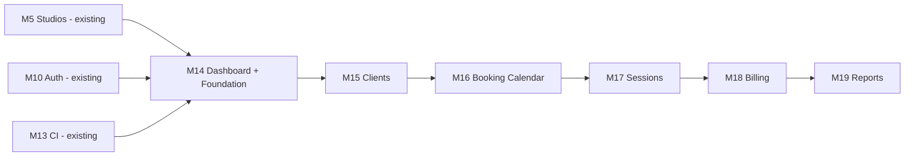
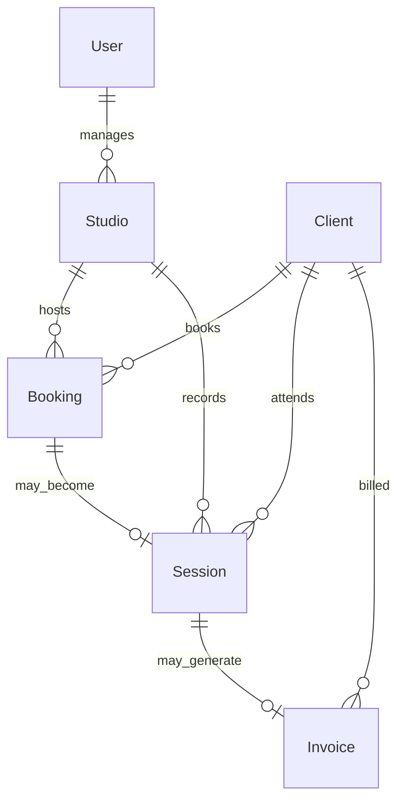

# M14 Planning Report — Phase 3: Production Studio Management

- Date: 2026-07-03
- Milestone: **M14 opens Phase 3** (master plan for M14–M19)
- Source: Phase 2 completion (`29c059b`), [phase2-roadmap.md](../roadmap/phase2-roadmap.md), M0–M13 planning and implementation reports, product direction from stakeholder priority list
- Status: **Planning only — no application code, dependencies, scaffolding commands, or commits have been generated.** Awaiting approval before implementation.

**Note on naming:** Phase 2 used one milestone per planning report (M12 = AI slice only). Phase 3 uses **this document as the Phase 3 master plan**, with **M14–M19** as the recommended implementation sequence — one business domain per milestone. **M14 implementation** (when approved) delivers item **#1 Dashboard** plus shared Phase 3 foundation; items **#2–#6** land in M15–M19.

## 1. Current Repository State (Post Phase 2)

Repository history after M13 (`29c059b`):

```
… (M0–M12 as documented in prior reports)
304f730 feat(ai): implement studio summary generation (M12)
29c059b feat(ci): implement CI/CD and hardening (M13)
```

What exists today:

| Layer | State |
|---|---|
| **Database** | `Studio` + `User` only (PostgreSQL + SQLite dual schema). No `Client`, `Booking`, `Session`, or `Invoice` models. |
| **API** | `health`, `studios`, `auth`, `sync`, `ai` modules. JWT auth (M10). Studio create/list only (M5). |
| **Desktop** | Tauri shell; local-first **Studios** via Rust SQLite + sync engine (M11). AI summary (M12). Nav: **Studios** only. |
| **Web** | Next.js portal; online Studios list/create + AI summary. Nav: **Studios** only. |
| **CI** | GitHub Actions: lint, typecheck, test, build, API smoke integration, optional Tauri build (M13). |
| **Tests** | Vitest unit tests for Studio vertical slice (validation, utils, api-sdk, api). 21 tests. |
| **Product docs** | `product-bible/`, `screen-specifications/` — **index only**, no feature specs authored yet. |
| **ADRs** | 0001 (Rust SQLite desktop), 0002 (custom JWT), 0003 (soft delete deferred). |

**Phase 2 outcome:** a working **technical platform** (monorepo, API, clients, auth, sync, AI, CI) with a single domain entity (`Studio`). Phase 3 turns that platform into a **production-ready recording studio management application** with real business workflows.

## 2. Phase 3 Goal

> **Goal:** evolve ST Manager from a Studio list/create demo into a **production-ready recording studio management application** — dashboard-first, client-centric, with booking, sessions, billing, and reporting.

**Guiding principles (carried forward from Phase 2):**

1. **Walking skeleton per milestone** — each M14–M19 slice ships end-to-end (schema → API → contracts → UI → validation) before widening scope.
2. **Web-first for operational workflows** — booking calendar, billing, and reports are primarily web experiences; desktop extends where offline/local-first adds clear value (see §6.3).
3. **Reuse existing layers** — `packages/{contracts,validation,api-sdk,ui,theme}`, Nest module pattern, JWT, CI smoke pattern.
4. **Production posture** — PostgreSQL as production datasource; migrations committed; CI coverage expands with each domain.

**Explicitly out of Phase 3 initial scope (defer to Phase 4+ unless approved):**

- Multi-tenant / multi-org SaaS isolation
- Payment processor integration (Stripe/PayPal live charges)
- Email/SMS notifications and calendar sync (Google/Outlook)
- Mobile native apps
- Advanced RBAC (engineer vs admin vs client portal)
- GDPR export/delete automation beyond ADR 0003 soft-delete pattern

## 3. Prioritized Business Features (Stakeholder Order)

| Priority | Domain | Phase 3 milestone | One-line outcome |
|---|---|---|---|
| **1** | **Dashboard** | **M14** | Signed-in user lands on an at-a-glance home: today's schedule, key counts, revenue snapshot, studio utilization. |
| **2** | **Client Management** | **M15** | CRUD clients (contacts, notes); link clients to future bookings/sessions/invoices. |
| **3** | **Studio Booking Calendar** | **M16** | Visual calendar per studio; create/edit/cancel bookings; conflict detection. |
| **4** | **Session Management** | **M17** | Turn bookings into tracked sessions (start/end, status, notes, optional link to invoice). |
| **5** | **Billing & Invoices** | **M18** | Generate invoices from sessions; draft/sent/paid lifecycle; printable/PDF export. |
| **6** | **Reports & Analytics** | **M19** | Revenue, utilization, and client activity reports over selectable date ranges. |

Each milestone **extends the Dashboard** with real widgets as its domain data becomes available (M14 ships the shell + Studio KPIs; M15 adds client count; M16 adds today's bookings; etc.).

## 4. Recommended Milestone Breakdown (M14–M19)



### M14 — Dashboard + Phase 3 Foundation (implement first on approval)

**Scope:**

- App shell navigation expanded: **Dashboard**, Studios (existing), placeholder nav entries for Clients, Calendar, Sessions, Billing, Reports (disabled or “Coming soon” until their milestone).
- **`GET /dashboard/summary`** (JWT) — aggregated KPIs available with current data:
  - `studioCount`, `recentStudios[]`
  - Placeholder zero/empty sections: `todayBookings[]`, `clientCount`, `monthRevenue`, `utilizationPercent` (schema-ready DTO shape; zeros until M15–M19).
- Dashboard page (web + desktop): KPI cards, empty-state panels, quick links to Studios and (when live) other modules.
- **`packages/constants`**: `ROUTES.DASHBOARD`, error codes as needed.
- Phase 3 **ADR 0004** (recommended): domain entity overview + web-first operational workflow decision.
- Extend CI: dashboard API smoke script; unit tests for summary service/mapper.

**Not in M14:** Client/booking/session/invoice CRUD (those are M15+).

### M15 — Client Management

- Prisma models: `Client` (`id`, `name`, `email?`, `phone?`, `company?`, `notes?`, timestamps, optional `deletedAt` per ADR 0003 pattern).
- API: `POST/GET/PATCH /clients`, `GET /clients/:id` (list + detail + update; soft delete optional in M15 or deferred).
- Web + desktop: Clients list, create/edit form, search/filter by name.
- Dashboard widget: **client count**, **recent clients**.
- Sync (desktop): extend M11 protocol for `Client` push/pull **or** document web-only until M15.1 — see open decision #2.

### M16 — Studio Booking Calendar

- Prisma: `Booking` (`studioId`, `clientId?`, `title`, `startAt`, `endAt`, `status`, `notes`, timestamps).
- API: CRUD + `GET /bookings?studioId=&from=&to=` for calendar range queries; **conflict check** on create/update (overlapping intervals per studio).
- Web: **month/week/day calendar view** (recommend week view MVP + month toggle); create booking from slot click.
- Desktop: read-only calendar or defer to M16.1 — see open decision #3.
- Dashboard widget: **today's bookings**, **upcoming this week**.

### M17 — Session Management

- Prisma: `Session` (`studioId`, `clientId?`, `bookingId?`, `startedAt`, `endedAt?`, `status`: scheduled/in_progress/completed/cancelled, `notes`).
- API: CRUD; `POST /sessions/:id/start`, `POST /sessions/:id/complete` for lifecycle transitions.
- Web: Sessions list (filter by date/status); detail drawer; link from booking → session.
- Dashboard widget: **sessions in progress**, **completed today**.

### M18 — Billing & Invoices

- Prisma: `Invoice` (`clientId`, `sessionId?`, `number`, `status`: draft/sent/paid/void, `subtotal`, `tax`, `total`, `dueDate`, `issuedAt`, line items as JSON or `InvoiceLineItem` relation).
- API: CRUD; `POST /invoices/:id/send`, `POST /invoices/:id/mark-paid`; generate from session.
- Web: Invoice list, editor, **print/PDF-friendly view** (CSS print or `@react-pdf/renderer` — decision in implementation).
- Dashboard widget: **outstanding balance**, **paid this month**.

### M19 — Reports & Analytics

- API: read-only aggregate endpoints, e.g. `GET /reports/revenue?from=&to=`, `GET /reports/utilization?from=&to=`, `GET /reports/clients?from=&to=`.
- Web: Reports page with date range picker, summary tables/charts (start with tables + simple bar chart; no heavy BI).
- Dashboard: deep-link to reports; optional embedded mini-chart for revenue trend.
- Export: CSV download for revenue report (M19 MVP).

## 5. Domain Model (Target End State)



**Relationships (recommended):**

- A **Booking** reserves a **Studio** for a time range; optionally links a **Client**.
- A **Session** represents actual studio use; may originate from a **Booking** or be ad hoc.
- An **Invoice** bills a **Client**, optionally tied to a **Session**; contains line items (studio time, equipment, engineering fee placeholders).

All entities use `cuid` primary keys (consistent with M5/M11). Timestamps on every model. Soft delete (`deletedAt`) on Client and optionally Booking/Invoice per ADR 0003 when delete endpoints ship.

## 6. Architecture Decisions (Recommended)

### 6.1 API module pattern

Each domain follows the M5 precedent:

```
apps/api/src/modules/{domain}/
  {domain}.module.ts
  {domain}.controller.ts
  {domain}.service.ts
  {domain}.repository.ts
  {domain}.mapper.ts   (if DTO mapping non-trivial)
```

Matching threads in `packages/contracts`, `packages/validation`, `packages/api-sdk`, and app-layer pages in `apps/web` + `apps/desktop`.

### 6.2 Dashboard as read orchestration

Dashboard does **not** own business rules — it aggregates via a `DashboardService` that calls domain repositories or lightweight aggregate queries. Keeps M14 thin and avoids duplicating booking/session logic later.

### 6.3 Client platform strategy

| Domain | Web | Desktop (M14–M19 recommendation) |
|---|---|---|
| Dashboard | Full | Full (online aggregates from API) |
| Clients | Full CRUD | Read-only list initially **or** full CRUD with sync in M15.1 |
| Booking calendar | Full | Read-only calendar (M16.1) or web-only M16 |
| Sessions | Full | Web-first |
| Billing | Full | Web-only |
| Reports | Full | Web-only |

**Recommendation:** **Web-primary** for calendar, billing, and reports; desktop gets Dashboard + Studios (existing) + optional read-only views. Avoid blocking M16–M19 on desktop sync complexity.

### 6.4 PostgreSQL in CI

Phase 3 introduces non-trivial migrations and aggregate queries. **Recommend** adding a PostgreSQL service container to CI (M14 or M15) alongside existing SQLite integration tests — validates production datasource path deferred since M5.

### 6.5 UI components

Extend `packages/ui` with shared primitives as needed ( `Badge`, `Table`, `Dialog`, `Calendar` shell ) — **not** full feature pages. Feature pages stay in apps (M6/M12 precedent). Calendar may use a headless date library (`@internationalized/date` + custom grid, or `react-day-picker` v9) — decide at M16 implementation.

## 7. Expected User-Visible Features (End of Phase 3)

After **M19**, a studio owner signing into the web app can:

| Area | User-visible capability |
|---|---|
| **Dashboard** | See today's bookings, active sessions, client count, month-to-date revenue, studio utilization %, and outstanding invoices at a glance. |
| **Clients** | Add and edit client contacts; search clients; view client history links to bookings/sessions/invoices. |
| **Calendar** | View bookings on a calendar by studio; create a booking by selecting a time slot; see conflicts prevented before save. |
| **Sessions** | Start and complete sessions; view session history; open a session from a booking. |
| **Billing** | Create an invoice from a completed session; mark sent/paid; print or download PDF; see invoice list filtered by status. |
| **Reports** | Run revenue, utilization, and client activity reports for a date range; export revenue to CSV. |

**Navigation:** sidebar includes Dashboard, Studios, Clients, Calendar, Sessions, Billing, Reports (all functional except where desktop is read-only/deferred).

**Studios (existing):** list/create, AI summary, auth — unchanged in behavior; Studios remains the anchor entity for bookings.

## 8. Estimated Implementation Time

Estimates assume **one experienced developer** familiar with the codebase, working in the established milestone workflow (plan → approve → implement → validate → commit). Includes schema, API, contracts, clients, tests, and docs — not product design workshops or UAT cycles.

| Milestone | Scope | Estimated duration |
|---|---|---|
| **M14** | Dashboard + Phase 3 foundation + ADR + CI extension | **1.5–2 weeks** |
| **M15** | Client Management (CRUD, web + desktop decision) | **2–2.5 weeks** |
| **M16** | Booking Calendar (API + calendar UI + conflicts) | **3–4 weeks** |
| **M17** | Session Management (lifecycle + UI) | **2–3 weeks** |
| **M18** | Billing & Invoices (line items + PDF + status flow) | **3–4 weeks** |
| **M19** | Reports & Analytics (aggregates + CSV export) | **2–3 weeks** |
| **Total Phase 3** | M14–M19 | **~14–18.5 weeks** (~3.5–4.5 months) |

**Critical path:** M14 → M15 → M16 → M17 → M18 → M19 (each depends on prior domain data for dashboard widgets and downstream links). M16 (calendar) is the longest pole; M18 (billing) second.

**Parallelization note:** UI shell work (nav, empty states) in M14 unblocks parallel design of screen specs under `docs/screen-specifications/` while M15 API work proceeds — not assumed in estimates above.

## 9. Risks

| # | Risk | Impact | Mitigation |
|---|---|---|---|
| 1 | **Dashboard-first with sparse data** | M14 dashboard looks empty until M16+ | Ship real Studio KPIs in M14; use honest empty states for future widgets; extend dashboard each milestone. |
| 2 | **Desktop sync scope creep** | M11 sync protocol rewrite for 4+ entities delays web features | Web-first for calendar/billing/reports; defer desktop sync to explicit sub-milestones (M15.1, M16.1). |
| 3 | **Calendar complexity** | Recurring bookings, time zones, DST edge cases | M16 MVP: single timezone (studio local), no recurrence, explicit conflict errors. |
| 4 | **Billing without payments** | Users expect Stripe | M18 scope: invoice **document** lifecycle only; label as “manual payment tracking”; Stripe in Phase 4. |
| 5 | **Schema migration drift** | SQLite dev vs PostgreSQL prod divergence | Dual-schema migrations in M15+; add Postgres CI job; mirror critical fields without `@db.VarChar` on SQLite where already established. |
| 6 | **No product bible content** | UX ambiguity | Author minimal screen specs per milestone during planning approval gate (before each implementation). |
| 7 | **Invoice numbering** | Collisions under concurrency | Server-generated sequential invoice numbers per studio/tenant with DB uniqueness constraint. |
| 8 | **Report query performance** | Slow aggregates on large datasets | Index `(studioId, startAt)`, `(clientId, issuedAt)`; limit default ranges; paginate detail drill-downs. |
| 9 | **Scope expansion** | Phase 3 becomes unfunded mega-release | Strict one-domain-per-milestone commits; dashboard grows incrementally; reject cross-milestone scope in review. |

## 10. Validation Plan

### 10.1 Per-milestone gates (every M14–M19)

1. `pnpm install`
2. `pnpm lint` — zero new errors/warnings
3. `pnpm typecheck` — all scoped packages pass
4. `pnpm test` — unit tests for new domain + regression on Studio slice
5. `pnpm build` — full monorepo build
6. Prisma `migrate dev` (SQLite) + `migrate deploy` rehearsal for PostgreSQL when CI added
7. New **`{domain}-smoke.sh`** or extend `ci-smoke.sh` for critical API paths
8. Manual e2e: sign in on web → exercise new screens → verify dashboard widgets update
9. `docs/meeting-notes/M{n}-implementation-report.md` before commit approval

### 10.2 Phase 3 completion gate (after M19)

| Check | Criterion |
|---|---|
| Dashboard | All six widget areas show **real data** (not placeholders) when seed data exists |
| Clients | Create client → appears in list, detail, dashboard count |
| Calendar | Create booking → visible on calendar → conflict rejected on overlap |
| Sessions | Complete session flow from booking |
| Billing | Invoice from session → PDF/print → mark paid → dashboard revenue updates |
| Reports | Revenue report matches sum of paid invoices in range; CSV export valid |
| CI | All jobs green on `main`; smoke suite covers auth + studios + new domains |
| Regression | M10–M12 smokes still pass |

### 10.3 Recommended seed script expansion

Extend `packages/database/scripts/seed-dev-user.ts` (or add `seed-dev-demo.ts`) in M15+ with sample clients, bookings, sessions, and invoices so dashboard/reports are demonstrable without manual data entry during QA.

## 11. M14 Implementation Preview (First Slice — On Approval)

When this plan is approved, **M14 implementation** (separate approval after M14 implementation report) would deliver:

**API**

- `GET /dashboard/summary` — JWT protected; returns KPI DTO with studio data populated, other sections empty/zero.

**Packages**

- `packages/contracts/src/dashboard/` — summary DTOs
- `packages/validation` — (query none for M14)
- `packages/api-sdk` — `createDashboardApi().getSummary()`
- `packages/constants` — `ROUTES.DASHBOARD`

**Clients**

- Web: `/` or `/dashboard` as landing route; KPI cards; empty-state cards for Clients/Calendar/Sessions/Billing/Reports
- Desktop: same Dashboard route; online-only API fetch
- Expanded `nav-items` with Phase 3 structure (future items disabled until live)

**Docs / ADR**

- `docs/system-architecture/adr/0004-phase3-domain-overview.md` (recommended)
- `docs/roadmap/phase3-roadmap.md` (recommended excerpt from this plan)

**Tests / CI**

- `apps/api/src/modules/dashboard/dashboard.service.spec.ts`
- `apps/api/scripts/dashboard-smoke.sh`
- Wire into `ci-smoke.sh`

## 12. Definition of Done

**This planning report (approval gate):**

- [ ] Stakeholder confirms prioritized feature order (Dashboard → … → Reports).
- [ ] Stakeholder confirms M14–M19 milestone split or requests merge/split changes.
- [ ] Open decisions in §13 resolved.
- [ ] No implementation until **M14 implementation** is explicitly requested after this report is approved.

**Phase 3 complete (after M19):**

- [ ] All six business domains shipped with user-visible features in §7.
- [ ] Dashboard shows real aggregated data across domains.
- [ ] CI green; domain smoke tests in place.
- [ ] PostgreSQL migration path verified in CI.
- [ ] Phase 3 implementation reports (M14–M19) committed.

## 13. Open Decisions Requiring Approval

1. **Milestone split:** **M14–M19 one domain each** (recommended) vs **fewer, larger milestones** (e.g. M14–M16 only).

2. **Dashboard route:** **`/` as dashboard** with `/studios` secondary (recommended) vs keep `/studios` as home and add `/dashboard`.

3. **Desktop scope:** **Web-primary for calendar/billing/reports** (recommended) vs full parity on desktop for every domain.

4. **Client sync on desktop:** **Defer to M15.1** (recommended) vs include in M15 scope (extends M11 sync protocol immediately).

5. **Soft delete:** Apply **`deletedAt` on Client from M15** (recommended per ADR 0003) vs hard delete only in Phase 3.

6. **Invoice tax:** **Single manual tax rate field** on invoice (recommended for M18) vs line-level tax vs no tax in MVP.

7. **PostgreSQL CI:** Add **Postgres service container in M14** (recommended) vs wait until M18 billing migrations.

---

**Stopping here per instructions** — no source code, dependencies, scaffolding commands, or commits have been touched. Awaiting review and approval of this Phase 3 plan (and the seven open decisions above) before M14 implementation begins.
