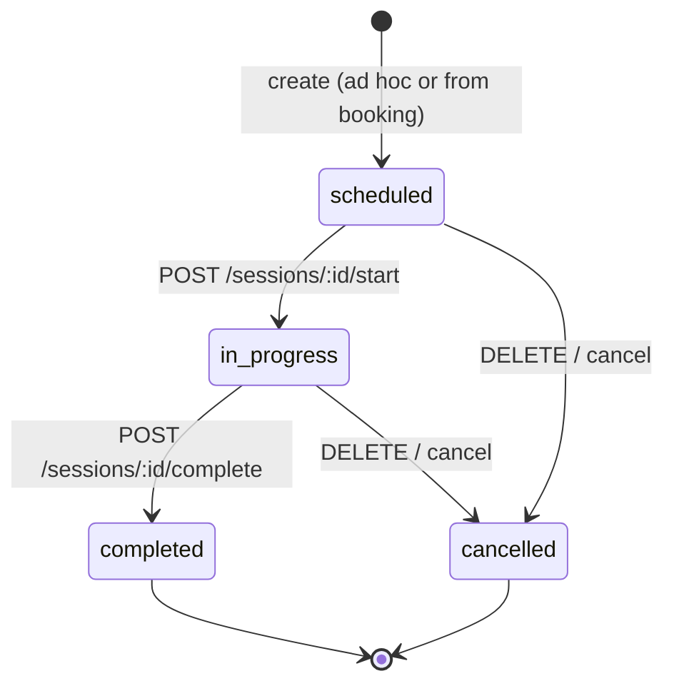

# M17 Planning Report — Session Management

- Date: 2026-07-03
- Milestone: M17 (Session Management)
- Source: [phase3-roadmap.md](../roadmap/phase3-roadmap.md), [M14 planning report](./M14-planning-report.md), [M15 planning report](./M15-planning-report.md), [M16 planning report](./M16-planning-report.md), [M16 implementation report](./M16-implementation-report.md), [ADR 0004](../system-architecture/adr/0004-phase3-domain-overview.md)
- Status: **Planning only — no application code, dependencies, scaffolding commands, or commits have been generated.** Awaiting approval before implementation.

**Note on source documents:** M17 scope is taken from the approved Phase 3 master plan ([M14 planning report §4](./M14-planning-report.md)) and [phase3-roadmap.md](../roadmap/phase3-roadmap.md). M14 reserved the Sessions nav slot and dashboard empty-state panel; M15 delivered live Clients; M16 delivered live Bookings and calendar UI. M17 introduces the `Session` entity, lifecycle transitions, booking conversion, and live dashboard session widgets.

## 1. Current Repository State (Post M16)

Repository history after M16 (`9510739`):

```
… (M0–M14 as documented in prior reports)
b5ce650 feat(dashboard): implement dashboard and Phase 3 foundation (M14)
612597b feat(clients): implement client management (M15)
9510739 feat(bookings): implement studio booking calendar (M16)
```

What exists today:

| Layer | State |
|---|---|
| **Database** | `Studio`, `User`, `Client`, `Booking` (PostgreSQL + SQLite dual schema). **No `Session` model.** Third Phase 3 entity relation (`Session.studioId`, `Session.clientId?`, `Session.bookingId?`). |
| **API** | `health`, `studios`, `auth`, `sync`, `ai`, `dashboard`, **`clients`**, **`bookings`** modules. `GET /dashboard/summary` returns live `clientCount`, `recentClients[]`, **`todayBookings[]`**; no session fields. |
| **Packages** | Threads for studio, auth, sync, ai, dashboard, client, **booking**. **No session thread.** |
| **Types** | `Studio`, `Client`, `Booking` only. **No `Session` domain type.** |
| **Web** | Dashboard `/`, Studios `/studios`, Clients `/clients`, Calendar `/calendar` (+ new/edit routes). Nav includes **Sessions (disabled, “Soon”)**. |
| **Desktop** | Dashboard `#/`, Studios `#/studios`, Clients `#/clients` (online API CRUD). Calendar nav disabled (M16 Option A). **Sessions nav disabled.** No local Session storage. |
| **CI** | `quality`, `test`, `api-integration` (SQLite full `ci-smoke.sh`), **`postgres-integration`** (dashboard + clients + **bookings** smokes), `desktop-build`. **No sessions smoke.** |
| **Tests** | **50 Vitest unit tests** (validation 21, utils 5, api-sdk 9, api 15 incl. bookings + dashboard). |
| **ADRs** | 0001 (desktop SQLite), 0002 (custom JWT), 0003 (soft delete deferred for **Studio**), **0004 (Phase 3 — Session is M17; web-first for sessions)**. |

**M16 outcome:** Booking CRUD, conflict detection, and web calendar are live. Dashboard shows today's bookings. Calendar nav is enabled on web. Booking → session conversion was explicitly deferred to M17. Sessions nav slot and dashboard panel remain placeholders.

## 2. M17 Goal (from Phase 3 Roadmap)

> **Goal:** Turn bookings into tracked sessions; start/end lifecycle; in-progress and completed widgets.

From [phase3-roadmap.md](../roadmap/phase3-roadmap.md):

| Milestone | Domain | Outcome |
|---|---|---|
| **M17** | Session Management | Session lifecycle; **in-progress/completed widgets** |

**Scope interpretation (strict):**

- **In scope:** `Session` Prisma model + dual-schema migration (relations to `Studio`, optional `Client`, optional `Booking`); NestJS `sessions` module (create, list, get-by-id, update, cancel; **`POST /sessions/:id/start`**, **`POST /sessions/:id/complete`**); contracts/validation/api-sdk/types thread; **create session from booking** (link `bookingId`); web Sessions pages (list with date/status filters; create/edit); **link from booking edit page → create/start session**; enable Sessions nav on web; extend `DashboardService` with live **`sessionsInProgress[]`** + **`completedTodaySessions[]`**; `sessions-smoke.sh` + CI wiring; unit tests for session service/lifecycle/validation; optional minimal screen spec stub.
- **Out of scope:** M11 sync protocol extension for Session (**M17.1**); `Invoice` model or foreign keys (**M18**); invoice generation from session; utilization % KPI (still placeholder until M19); recurring sessions; multi-engineer assignment; equipment tracking; audio file attachments; external DAW integration; changes to Booking/Client/sync behavior except optional read-only booking link on session create and FK validation.

M17 **requires schema migration with relations, API module with lifecycle rules, sessions UI, booking conversion entry point, and dashboard widgets**. It should **not** block on desktop offline/sync complexity or billing.

## 3. Data Model

### 3.1 `Session` entity (recommended)

Third related Phase 3 entity. Follows M5/M15/M16 conventions (`cuid`, timestamps, dual schema).

| Field | Type | Notes |
|---|---|---|
| `id` | `String @id @default(cuid())` | Server-generated only |
| `studioId` | `String` | **Required** FK → `Studio.id` |
| `clientId` | `String?` | Optional FK → `Client.id` (must reference active client) |
| `bookingId` | `String? @unique` | Optional FK → `Booking.id` — **at most one session per booking** |
| `title` | `String` | Required display label (default from booking title when converted) |
| `startedAt` | `DateTime` | Planned or actual session start |
| `endedAt` | `DateTime?` | Set on complete; null while in progress |
| `status` | `String` | MVP enum as string: `scheduled` \| `in_progress` \| `completed` \| `cancelled` |
| `notes` | `String?` | Free-text session notes |
| `deletedAt` | `DateTime?` | Soft delete / archive (optional — see open decision #2) |
| `createdAt` | `DateTime @default(now())` | |
| `updatedAt` | `DateTime @updatedAt` | |

**PostgreSQL schema** (`packages/database/prisma/postgresql/schema.prisma`):

- `title` → `@db.VarChar(120)`
- `status` → `@db.VarChar(32)` with default `"scheduled"`
- `notes` → `@db.Text` optional
- Relations:
  - `studio Studio @relation(fields: [studioId], references: [id])`
  - `client Client? @relation(fields: [clientId], references: [id])`
  - `booking Booking? @relation(fields: [bookingId], references: [id])`
- Indexes:
  - `@@index([studioId, status, startedAt])` — list + dashboard queries
  - `@@unique([bookingId])` where bookingId not null (Prisma `@unique` on optional field)

**SQLite schema** (`packages/database/prisma/sqlite/schema.prisma`):

- Same fields **without** `@db.*` attributes (M2/M11 dual-schema rule)
- Same relations, unique constraint, and indexes
- `@@map("sessions")`

**Prisma relation back-references:**

- `Studio.sessions Session[]`
- `Client.sessions Session[]`
- `Booking.session Session?` (optional one-to-one)

### 3.2 Domain type

`packages/types/src/session.ts`:

```ts
export type SessionStatus = "scheduled" | "in_progress" | "completed" | "cancelled";

export interface Session {
  id: string;
  studioId: string;
  clientId: string | null;
  bookingId: string | null;
  title: string;
  startedAt: Date;
  endedAt: Date | null;
  status: SessionStatus;
  notes: string | null;
  deletedAt: Date | null;
  createdAt: Date;
  updatedAt: Date;
}
```

Response DTOs may embed `studioName`, `clientName`, and `bookingTitle` for list/detail display without extra round-trips.

### 3.3 Status lifecycle (core business rule)



**Rules:**

1. **Create** — default `status: scheduled`. `startedAt` required (defaults to booking `startAt` when converted, or user-provided for ad hoc).
2. **Start** — only from `scheduled` → `in_progress`. Sets `startedAt` to `now()` (recommended) or preserves planned start if already in future — see open decision #7.
3. **Complete** — only from `in_progress` → `completed`. Sets `endedAt` to `now()`.
4. **Cancel** — `scheduled` or `in_progress` → `cancelled` (per open decision #2).
5. **Active filter** — list/get/dashboard exclude `cancelled` (and soft-deleted if applicable).
6. **Booking conversion** — if `bookingId` provided: booking must exist, be `confirmed`, not already linked to a session, and studio/client copied from booking unless overridden.

### 3.4 Booking → session link

Per M14 domain model: `Booking ||--o| Session : may_become`.

- **Recommended:** `POST /sessions` accepts optional `bookingId`. Service copies `studioId`, `clientId`, `title`, and `startedAt` from booking (`startAt`) when omitted.
- **Alternative:** dedicated `POST /sessions/from-booking/:bookingId` — see open decision #5.
- Web: **“Start session”** action on `/calendar/[id]` when booking is confirmed and has no linked session.

## 4. API Design

### 4.1 Module layout

```
apps/api/src/modules/sessions/
  sessions.module.ts
  sessions.controller.ts
  sessions.service.ts
  sessions.repository.ts
  sessions.mapper.ts
  sessions.service.spec.ts
```

Register `SessionsModule` in `app.module.ts`. Export `SessionsRepository` for `DashboardModule` aggregation (M14/M15/M16 dashboard pattern).

### 4.2 Routes (`ROUTES.SESSIONS = "sessions"`)

All routes **JWT-protected** (recommended — matches Clients/Bookings; see open decision #4).

| Method | Path | Status | Description |
|---|---|---|---|
| `POST` | `/sessions` | 201 / 404 / 409 | Create session (ad hoc or with `bookingId`) |
| `GET` | `/sessions` | 200 | List with filters: `studioId?`, `status?`, `from?`, `to?` |
| `GET` | `/sessions/:id` | 200 / 404 | Get active session |
| `PATCH` | `/sessions/:id` | 200 / 404 | Update editable fields (not status — use lifecycle routes) |
| `DELETE` | `/sessions/:id` | 200 / 404 | Cancel session |
| `POST` | `/sessions/:id/start` | 200 / 404 / 409 | Transition `scheduled` → `in_progress` |
| `POST` | `/sessions/:id/complete` | 200 / 404 / 409 | Transition `in_progress` → `completed` |

**Not in M17:** `POST /sessions/:id/restore`, bulk import, invoice generation endpoints.

**Conflict / invalid transition:** return **`409 Conflict`** with `{ success: false, error: { code: "SESSION_INVALID_TRANSITION", message: "..." } }` (extend HTTP exception filter pattern like `BOOKING_CONFLICT`).

**Duplicate booking session:** return **`409 Conflict`** with `SESSION_BOOKING_ALREADY_LINKED` when `bookingId` already has a session.

### 4.3 List query

`GET /sessions?studioId=&status=&from=&to=`

- **Optional filters:** `studioId`, `status`, `from`, `to` (ISO 8601 datetimes on `startedAt`)
- Returns active sessions matching filters, ordered by `startedAt` desc
- Default web list: today's range or last 7 days with pagination (`page`, `pageSize`) — reuse Clients list pattern

### 4.4 Response shape (contracts)

`packages/contracts/src/session/`:

- `create-session.dto.ts`, `update-session.dto.ts`
- `list-sessions-query.dto.ts` — optional filters + pagination
- `session-response.dto.ts` — includes denormalized `studioName`, `clientName`, `bookingTitle | null`
- Envelope types: `CreateSessionResponseDto`, `ListSessionsResponseDto`, `StartSessionResponseDto`, `CompleteSessionResponseDto`, etc.

Validation in `packages/validation/src/session/`:

- `createSessionSchema`, `updateSessionSchema`, `listSessionsQuerySchema`
- Datetime strings → `z.string().datetime()`
- Optional `bookingId` refine: valid cuid format

## 5. Dashboard Extension

M14 dashboard panel reserved for Sessions. M17 adds new summary fields to `DashboardSummaryDataDto`:

```ts
export interface DashboardSessionSummaryDto {
  id: string;
  title: string;
  studioId: string;
  studioName: string;
  clientName: string | null;
  startedAt: string;
  status: "scheduled" | "in_progress" | "completed" | "cancelled";
}

export interface DashboardSummaryDataDto {
  // … existing fields …
  sessionsInProgress: DashboardSessionSummaryDto[];
  completedTodaySessions: DashboardSessionSummaryDto[];
}
```

**M17 changes:**

| Field | M17 value |
|---|---|
| `sessionsInProgress[]` | Live list — active sessions with `status = in_progress` |
| `completedTodaySessions[]` | Live list — sessions with `status = completed` and `endedAt` intersecting **today** (UTC day boundaries, same as `todayBookings`) |
| `todayBookings[]`, client KPIs, studio KPIs | Unchanged (live from M16/M15/M14) |
| `monthRevenue`, `utilizationPercent` | Still `0` (M18/M19) |

**DashboardService** imports `SessionsRepository` (same pattern as `BookingsRepository`).

**Dashboard UI (web + desktop):**

- Replace empty “Sessions” panel with live **In progress** list and **Completed today** list (or combined panel with two subsections)
- Remove “Coming in a future milestone” hint from Sessions panel

## 6. Web UI (`apps/web`)

### 6.1 Routes (recommended)

| Route | Purpose |
|---|---|
| `/sessions` | Sessions list (filters: studio, status, date range) |
| `/sessions/new` | Create ad hoc session (optional `?bookingId=` pre-fill from calendar) |
| `/sessions/[id]` | Session detail — view status, start/complete/cancel actions, edit notes |

Separate routes match M15 Clients and M16 Calendar UX precedent (open decision #6).

### 6.2 Sessions list (recommended MVP)

- **Filters** — studio dropdown, status select (`all`, `scheduled`, `in_progress`, `completed`), date range (default: today)
- **Table or card list** — title, studio, client, status badge, started/ended times
- **Row actions** — view detail; quick **Start** for `scheduled`; **Complete** for `in_progress`
- **Create** — “New session” button → `/sessions/new`

### 6.3 Booking integration

- **`/calendar/[id]`** — when booking is confirmed and has no linked session, show **“Start session”** → creates session (or navigates to `/sessions/new?bookingId=…`)
- After session exists, show link **“View session”** → `/sessions/[id]`

### 6.4 Shared form

- `SessionForm` — title, studio (required), optional client, optional booking (read-only when pre-filled), planned `startedAt`, notes
- Status and lifecycle actions on detail page only (not on create form)

### 6.5 Nav & proxy

- Enable Sessions in `nav-items.ts` (remove `disabled` / `comingSoon`)
- Add `/api/sessions` rewrites in `next.config.ts`
- `bookingsApi` pattern → `sessionsApi` in `api-client.ts`

## 7. Desktop UI (`apps/desktop`)

Per ADR 0004 and M16 precedent, sessions are **web-primary**.

| Option | M17 effort | Capability |
|---|---|---|
| **A. Web-only — dashboard widgets only on desktop** (recommended) | Low | Desktop nav Sessions stays disabled; dashboard shows live in-progress/completed widgets via online API |
| **B. Read-only online sessions list** | Medium | View sessions list/detail; no start/complete on desktop |
| **C. Full online CRUD + lifecycle** (mirror web) | High | Same as web when signed in |

**Recommendation:** **Option A** — web-only session management in M17. Desktop dashboard receives live **`sessionsInProgress[]`** and **`completedTodaySessions[]`** via existing online dashboard fetch. Enables M17.1 for desktop sessions + sync without blocking web delivery.

## 8. Migrations & Dual Schema

M17 extends the Phase 3 relation graph (`Booking ──o| Session`).

1. Edit **both** PostgreSQL and SQLite schemas — add `Session` model + `Studio`/`Client`/`Booking` back-relations
2. Generate migrations:
   - SQLite: `pnpm --filter @st-manager/database run db:migrate:sqlite:dev`
   - PostgreSQL: new migration folder under `prisma/postgresql/migrations/`
3. `pnpm run db:generate` — regenerate both Prisma clients
4. CI `postgres-integration` — new migration must deploy cleanly

**Rust desktop SQLite:** **No change in M17** if desktop Option A (web-only). M17.1 would add sessions table + sync when approved.

**Seed (optional, recommended):** extend seed script with 1–2 sample sessions (one in progress, one completed today) for dashboard QA.

## 9. Tests & CI

### 9.1 Unit tests (recommended minimum)

| Location | Tests |
|---|---|
| `packages/validation/src/session/session.schema.test.ts` | create/update/list schemas |
| `apps/api/src/modules/sessions/sessions.service.spec.ts` | create; from booking; start; complete; invalid transition 409; cancel; not-found |
| `packages/api-sdk/src/sessions/sessions.api.test.ts` | create unwrap; start/complete calls |

Target: **+12–16 tests** (regression on existing 50).

### 9.2 Integration smoke

**`apps/api/scripts/sessions-smoke.sh`:**

1. `GET /sessions` without token → 401
2. Login → ensure studio + confirmed booking exist (create if needed)
3. `POST /sessions` with `bookingId` → 201; duplicate same `bookingId` → **409**
4. `POST /sessions/:id/start` → 200 (`in_progress`)
5. `POST /sessions/:id/complete` → 200 (`completed`, `endedAt` set)
6. Create second session (`scheduled`) → `POST /sessions/:id/start` on completed session → **409**
7. `GET /sessions?status=in_progress` → includes/excludes correctly
8. `DELETE /sessions/:id` → cancel; excluded from active list
9. `GET /dashboard/summary` → `sessionsInProgress[]` and `completedTodaySessions[]` array shapes valid

Wire into `ci-smoke.sh` (update suite label to M17). Extend **`postgres-integration`** to run `sessions-smoke.sh` after bookings smoke (open decision #8).

## 10. Estimated Implementation Time

| Area | Estimate |
|---|---|
| Schema + migration (dual, relations, unique bookingId) | 1–1.5 days |
| API module + lifecycle logic + tests | 2–3 days |
| Contracts / validation / api-sdk | 1–1.5 days |
| Web sessions UI (list + forms + booking link) | 2–3 days |
| Desktop (Option A: dashboard widgets only) | 0.5 day |
| Dashboard extension + UI | 1 day |
| Smoke + CI + docs | 0.5–1 day |
| **Total M17** | **~2–3 weeks** (matches Phase 3 master plan) |

Assumes one developer familiar with the codebase, plan → approve → implement → validate workflow.

## 11. Risks

| # | Risk | Impact | Mitigation |
|---|---|---|---|
| 1 | **Lifecycle state machine bugs** | Sessions stuck or double-started | Unit test all transitions; reject invalid via 409 |
| 2 | **Booking-session coupling** | Orphan or duplicate sessions per booking | Unique `bookingId`; validate booking status on create |
| 3 | **Dashboard query overlap** | Confusion between today's bookings vs in-progress sessions | Clear UI labels; separate DTO fields |
| 4 | **Desktop scope creep** | Sync rewrite delays web | Web-only sessions (Option A); M17.1 for desktop |
| 5 | **Time boundary inconsistency** | “Completed today” mismatches bookings widget | Reuse UTC day logic from `BookingsRepository.findToday()` |
| 6 | **FK validation** | Session references deleted client/booking | Service-layer checks; booking must be confirmed |
| 7 | **PATCH vs lifecycle endpoints** | Clients bypass state machine via PATCH | Disallow status changes on PATCH; lifecycle routes only |
| 8 | **No invoice link yet** | Users expect billing from completed session | Empty state / copy directing to M18; no invoice FK in M17 |

## 12. Validation Plan

### 12.1 Pre-commit gates

1. `pnpm install`
2. `pnpm lint` — zero new errors/warnings
3. `pnpm typecheck` — all scoped packages pass
4. `pnpm test` — session unit tests + regression
5. `pnpm build` — full monorepo build
6. SQLite `migrate dev` + manual create/start/complete/cancel on web sessions
7. `bash apps/api/scripts/sessions-smoke.sh` + full `ci-smoke.sh`
8. Sign in → create session from booking → start → complete → visible on dashboard
9. `docs/meeting-notes/M17-implementation-report.md` before commit approval

### 12.2 Manual e2e checklist

| Step | Criterion |
|---|---|
| Web sessions list | Filter by status → correct rows |
| Web create | Ad hoc session → appears in list as `scheduled` |
| Web from booking | Calendar booking → start session → linked |
| Web start | Scheduled session → start → status `in_progress` |
| Web complete | In-progress session → complete → `endedAt` set |
| Web cancel | Cancel removes from active list |
| Dashboard | In-progress and completed-today panels show real data |
| Regression | Clients, bookings, studios, auth, sync, AI, dashboard smokes pass |

## 13. Expected User-Visible Features (End of M17)

After M17, a signed-in studio owner can:

| Surface | Capability |
|---|---|
| **Web `/sessions`** | List sessions with filters; create ad hoc session; view detail; start, complete, or cancel a session |
| **Web `/calendar/[id]`** | Start a session from a confirmed booking; link to existing session |
| **Desktop** | Dashboard **in-progress** and **completed today** widgets live when online (session pages deferred per open decision #1) |
| **Dashboard** | Sessions panel shows real data; Sessions nav entry active on web |
| **API** | Authenticated session CRUD + lifecycle transitions + booking conversion |

**Not yet available:** invoice from session; utilization KPI; desktop session CRUD; offline session storage; sync for Session entity.

## 14. M17 Implementation Preview (On Approval)

When this plan is approved, **M17 implementation** would deliver:

**Database**

- `Session` model in both Prisma schemas + committed migrations
- Relations to `Studio`, optional `Client`, optional one-to-one `Booking`
- Indexes for list and dashboard queries

**API**

- `POST/GET/PATCH/DELETE /sessions`, `GET /sessions/:id` — JWT protected
- `POST /sessions/:id/start`, `POST /sessions/:id/complete` — lifecycle transitions
- **409 Conflict** on invalid transitions and duplicate booking session

**Packages**

- `packages/types` — `Session`, `SessionStatus`
- `packages/contracts/src/session/` — DTOs
- `packages/validation/src/session/` — Zod schemas
- `packages/api-sdk` — `createSessionsApi()`
- `packages/constants` — `ROUTES.SESSIONS`, `SESSION_INVALID_TRANSITION`, `SESSION_BOOKING_ALREADY_LINKED`

**Dashboard**

- Live `sessionsInProgress[]` + `completedTodaySessions[]` in `GET /dashboard/summary`
- Dashboard UI shows session widgets (web + desktop)

**Sessions (web)**

- `/sessions`, `/sessions/new`, `/sessions/[id]`
- Booking → session entry on `/calendar/[id]`
- Nav enabled on web

**Tests / CI**

- `sessions.service.spec.ts`, validation tests, api-sdk tests
- `sessions-smoke.sh` wired into `ci-smoke.sh`

**Docs**

- `docs/meeting-notes/M17-implementation-report.md`

## 15. Open Decisions Requiring Approval

1. **Desktop Sessions in M17:** **Web-only sessions; desktop dashboard widgets only** (recommended, Option A) vs **read-only online list** (Option B) vs **full online CRUD + lifecycle on desktop** (Option C).

2. **Cancel semantics:** **`status: cancelled` only** (recommended, matches M16 booking cancel) vs **`status: cancelled` + `deletedAt`** vs **soft-delete via `deletedAt` only**.

3. **Dashboard session widgets:** Populate **`sessionsInProgress[]` + `completedTodaySessions[]`** (recommended — matches M14 panel copy) vs **counts only** (`sessionsInProgressCount`, `completedTodayCount`) without detail arrays.

4. **Route auth:** **All session routes JWT-protected** (recommended) vs public `GET /sessions` list.

5. **Booking conversion API:** **`POST /sessions` with optional `bookingId`** (recommended) vs **dedicated `POST /sessions/from-booking/:bookingId`**.

6. **Web create/edit UX:** **Separate routes** (`/sessions/new`, `/sessions/[id]`) (recommended) vs **list page with modal/drawer** (M14 “detail drawer” wording).

7. **Start timestamp on `POST /sessions/:id/start`:** **Set `startedAt` to `now()`** (recommended — records actual start) vs **preserve planned `startedAt`** from create.

8. **PostgreSQL CI:** Extend **`postgres-integration`** to run **`sessions-smoke.sh`** (recommended) vs SQLite `api-integration` only for session smokes.

---

**Stopping here per instructions** — no source code, dependencies, scaffolding commands, or commits have been touched. Awaiting review and approval of this M17 plan (and the eight open decisions above) before M17 implementation begins.

## 16. Definition of Done

**This planning report (approval gate):**

- [ ] Stakeholder confirms M17 scope (Session CRUD + lifecycle + booking link + dashboard widgets, no Invoice/sync).
- [ ] Open decisions in §15 resolved.
- [ ] No implementation until **M17 implementation** is explicitly requested after this report is approved.

**M17 complete (after implementation):**

- [ ] `Session` model migrated in SQLite + PostgreSQL with Studio/Client/Booking relations
- [ ] Session API operational, JWT-protected, lifecycle transitions enforced
- [ ] Web sessions UI functional (list, create, detail, start/complete/cancel)
- [ ] Booking → session entry point on web calendar edit page
- [ ] Desktop sessions per approved Option A/B/C
- [ ] Dashboard shows live `sessionsInProgress[]` + `completedTodaySessions[]`
- [ ] Sessions nav enabled on web; smokes + unit tests in CI
- [ ] `docs/meeting-notes/M17-implementation-report.md` committed
- [ ] Nothing committed until implementation report is reviewed and approved
