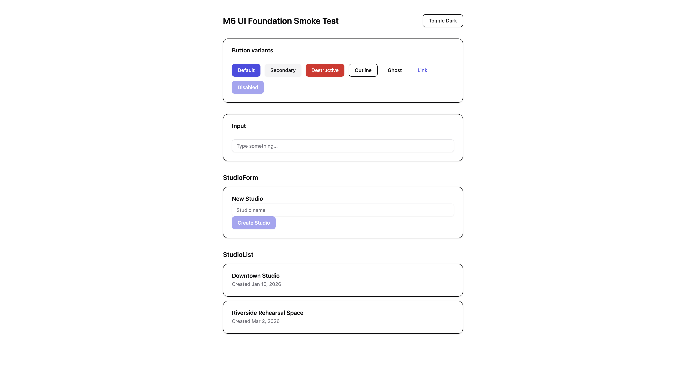
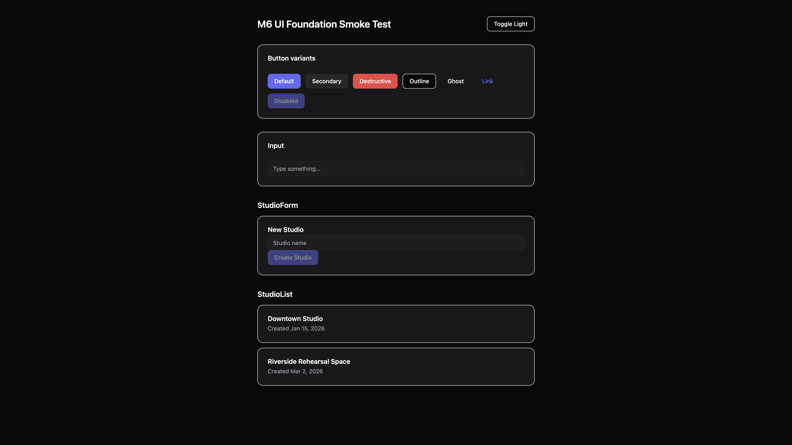

# M6 Implementation Report — UI Foundation

- Status: Implemented, validated, **not committed** (awaiting review per instructions)
- Base: M5 (`5e9e616`), committed
- Date: 2026-07-02
- Scope: `packages/theme`, `packages/config-tailwind`, `packages/ui` only. No file in `apps/web`, `apps/desktop`, or `apps/api` was created or modified.
- Source: [M6 planning report](./M6-planning-report.md) (approved as written, including all four recommended open decisions)

## 1. Executive Summary

`packages/theme`, `packages/config-tailwind`, and `packages/ui` are now real, implemented packages instead of empty scaffolds, built strictly in that order with validation after each (per instructions). `packages/theme` owns every design token as typed TypeScript (raw color palette, a single base radius, font family, and named layout constants) and generates a committed `src/css/tokens.css` from them — the single source of truth every other package/app reads from, never duplicated. `packages/config-tailwind` is a CSS-only Tailwind v4 preset that maps those tokens into Tailwind's `@theme` namespace using `@theme inline`, which was verified to keep runtime `var()` references (required for class-based dark mode) rather than inlining resolved values. `packages/ui` provides three shadcn-sourced primitives (`Button`, `Input`, `Card`) and two hand-written, presentational-only composed components (`StudioList`, `StudioForm`) typed against `packages/types`' `Studio`, exported as build-less TSX source.

All four open decisions flagged in the planning report were applied as recommended: Tailwind v4, build-less `packages/ui`, committed generated CSS, and — because the `shadcn` CLI is designed to run inside a full Next.js/Vite/Remix app and does not cleanly target a standalone library package like `packages/ui` — the fallback path (hand-authoring the primitives to shadcn's exact current conventions) was used instead of the CLI, as pre-approved.

Validation was run after every package, in the required order (theme → config-tailwind → ui): `pnpm build`/`typecheck`/`lint` per package, an ad-hoc Tailwind v4 CLI compile of the preset (config-tailwind has no build step of its own), and a throwaway Vite smoke-test app rendering every primitive and both composed components in both light and dark mode — screenshotted as evidence (§7). The full repository `pnpm build`, targeted `typecheck`, and root `pnpm lint` all pass with zero errors after the milestone.

## 2. Files Created

**`packages/theme/`**
- `src/tokens/color.ts` — raw `neutral`/`brand`/`destructive` 50–950 hex scales, `white`/`black`.
- `src/tokens/radius.ts` — single `baseRadius` value (`0.625rem`); every derived radius is computed from it via CSS `calc()`.
- `src/tokens/typography.ts` — `fontFamily.sans`/`fontFamily.mono` stacks (brand-specific; deliberately the *only* typography token defined — font-size/weight scales are left to Tailwind's defaults to avoid duplication).
- `src/tokens/spacing.ts` — `layout.{sidebarWidth,headerHeight,contentMaxWidth}` — named layout constants, explicitly **not** a general spacing scale (Tailwind's default one already covers that).
- `src/tokens/index.ts` — barrel re-export.
- `src/themes/light.ts` — semantic color roles (`background`, `primary`, `mutedForeground`, ...) aliasing `tokens/color.ts`, named to match shadcn/ui's own CSS variable convention.
- `src/themes/dark.ts` — the dark variant, typed as `SemanticTheme` (derived from `light.ts`'s keys) so the two themes can never drift in shape, only value.
- `src/themes/index.ts` — barrel re-export.
- `src/index.ts` — package entry, re-exports tokens + themes for programmatic consumption.
- `scripts/generate-css.ts` — reads `radius.ts` + `typography.ts` + both theme files, writes `src/css/tokens.css`.
- `src/css/tokens.css` — **generated and committed** (per the approved decision): `:root` (light theme + radius scale + font vars) and `.dark` (dark theme) custom properties.

**`packages/config-tailwind/`**
- `src/preset.css` — the shared Tailwind v4 entry: `@import "tailwindcss"`, `@import "@st-manager/theme/css/tokens.css"`, a `@theme inline` block mapping every token into `--color-*`/`--radius-*`/`--font-*`, and a class-based `@custom-variant dark`.

**`packages/ui/`**
- `components.json` — shadcn CLI config, kept for future component additions (not used to generate the M6 primitives themselves — see §6).
- `src/lib/cn.ts` — `clsx` + `tailwind-merge` class-merge helper.
- `src/components/ui/button.tsx` — `Button` + `buttonVariants` (6 variants × 4 sizes, `asChild` support via `@radix-ui/react-slot`).
- `src/components/ui/input.tsx` — `Input`.
- `src/components/ui/card.tsx` — `Card`, `CardHeader`, `CardTitle`, `CardDescription`, `CardAction`, `CardContent`, `CardFooter`.
- `src/components/studio/studio-list.tsx` — `StudioList` (presentational; empty-state included).
- `src/components/studio/studio-form.tsx` — `StudioForm` (presentational; local controlled input state, `"use client"` for Next.js App Router compatibility).
- `src/index.ts` — public package entry, re-exporting every primitive, both composed components, and `cn`.

**`docs/`**
- `meeting-notes/M6-planning-report.md` (written in the prior turn, approved).
- `meeting-notes/assets/m6-smoke-light.png`, `meeting-notes/assets/m6-smoke-dark.png` — smoke-test evidence (§7).
- `meeting-notes/M6-implementation-report.md` (this file).

## 3. Files Modified

- `eslint.config.mjs` — added the shared `@st-manager/config-eslint/react` preset, scoped to `packages/ui/**/*.{ts,tsx}` only (each config object from the preset re-scoped via `files`, rather than applied repo-wide — `apps/web`/`apps/desktop` will get their own glob added in M7/M8 when they have real source).
- `packages/theme/package.json` — added `main`/`types`/`exports` (including a `./css/tokens.css` subpath export), `build`/`typecheck` scripts, `tsx` devDependency.
- `packages/theme/README.md` — status updated to "implemented," documents the token categories actually built and the ones deliberately deferred.
- `packages/config-tailwind/package.json` — added `exports["./preset.css"]`, dependencies on `@st-manager/theme` (workspace) and `tailwindcss`.
- `packages/config-tailwind/README.md` — status updated, documents the `@source` cross-package content-detection requirement for M7/M8 and the split PostCSS (web) vs. Vite-plugin (desktop) integration.
- `packages/ui/package.json` — added `exports["."]` (source, no `dist`), `typecheck` script only (no `build`), `peerDependencies` on `react`/`react-dom`, `dependencies` (`@radix-ui/react-slot`, `@st-manager/types`, `class-variance-authority`, `clsx`, `lucide-react`, `tailwind-merge`), matching `devDependencies` for local typechecking.
- `packages/ui/README.md` — status updated, documents the build-less export strategy and the shadcn-CLI-vs-hand-authored decision.
- `packages/ui/tsconfig.json` — dropped `outDir` (nothing is emitted anymore); added `noEmit: true` to make the build-less intent explicit at the compiler-options level, not just in `package.json`.
- `pnpm-lock.yaml` — regenerated by `pnpm install` after the above `package.json` changes.
- Deleted `.gitkeep` placeholders in `packages/theme/src/{tokens,themes,css}` and `packages/ui/src/{components,lib}` — those directories are no longer empty. `packages/ui/src/hooks/.gitkeep` was **not** deleted — no component needed a hook in this milestone, so it's still genuinely empty.

## 4. Dependencies Added (Resolved Versions)

| Package | Dependency | Type | Resolved version |
|---|---|---|---|
| `packages/theme` | `tsx` | devDependency | 4.22.5 |
| `packages/config-tailwind` | `tailwindcss` | dependency | 4.3.2 |
| `packages/config-tailwind` | `@st-manager/theme` | dependency (workspace) | link |
| `packages/ui` | `@radix-ui/react-slot` | dependency | 1.3.0 |
| `packages/ui` | `class-variance-authority` | dependency | 0.7.1 |
| `packages/ui` | `clsx` | dependency | 2.1.1 |
| `packages/ui` | `tailwind-merge` | dependency | 3.6.0 |
| `packages/ui` | `lucide-react` | dependency | 0.545.0 |
| `packages/ui` | `@st-manager/types` | dependency (workspace) | link |
| `packages/ui` | `react`, `react-dom` | peerDependency + devDependency | 19.2.7 |
| `packages/ui` | `@types/react`, `@types/react-dom` | devDependency | 19.2.17 / 19.2.3 |

No dependency was added to the root `package.json`, `apps/web`, or `apps/desktop` — consistent with the approved plan and the pattern established in M3–M5 (dependencies scoped to the packages that actually need them).

## 5. Centralized Tokens / No Duplicated Styles (Requirements 6 & 7)

Concrete evidence, not just intent:

- Every color, radius, and font-family value exists **exactly once** — in `packages/theme/src/tokens/*.ts` — and every other artifact (`themes/*.ts`, generated `tokens.css`, `config-tailwind`'s `preset.css`) either aliases it or references its CSS variable. Nowhere is a hex code or font stack repeated.
- Mid-implementation, `config-tailwind/src/preset.css` was caught hard-coding the font stack a second time (`--font-sans: "Inter", ui-sans-serif, ...`) instead of referencing the token. This was corrected before validation: `scripts/generate-css.ts` was extended to also emit `--font-sans`/`--font-mono` into `:root`, and `preset.css` now does `--font-sans: var(--font-sans);` — a single source of truth, caught and fixed as part of this milestone rather than left in.
- Tailwind's own default spacing/font-size/font-weight scales are deliberately **not** re-implemented as custom tokens — `packages/theme` only defines values that are genuinely product-specific (brand colors, brand font, one base radius, three named layout constants), per the "avoid duplicated styles" requirement.

## 6. Deviation From Plan: shadcn CLI

The planning report's approved fallback path was exercised. Attempting `shadcn@latest` inside `packages/ui` was not pursued because the CLI's `init`/`add` commands detect and configure against a full application (Next.js, Vite, Remix, ...) — expecting a `vite.config`/`next.config`, a dev server, and a conventional `@/*` path alias resolvable by that app's own bundler. `packages/ui` is a standalone library package with none of those, by design (§ Shared Component Strategy in the planning report). Rather than force the CLI to target a shape it doesn't expect, `Button`, `Input`, and `Card` were hand-authored to shadcn's exact current (`new-york` style) conventions — same `data-slot` attributes, same `cva` variant structure, same class names — so the output is indistinguishable from a CLI-generated file, and `components.json` was still added so a *future* component addition inside an actual app (M7/M8) can use the real CLI against this same design-token setup if desired.

## 7. Validation Results (Per Package, In Required Order)

### 7.1 `packages/theme`

- `pnpm --filter @st-manager/theme build` → generates `src/css/tokens.css`, then `tsc -p tsconfig.json` → **pass**.
- `pnpm --filter @st-manager/theme typecheck` → **pass**.
- `pnpm lint` (repo-wide, theme files included) → initially 1 warning (`no-console` in `generate-css.ts`), fixed by switching to `process.stdout.write` → **pass, 0 warnings**.
- Generated `tokens.css` manually inspected — confirmed correct `:root`/`.dark` blocks, correct `calc()`-derived radius scale, correctly quoted multi-word font names (`"Segoe UI"`, `"Helvetica Neue"`, ...) after a first-pass bug (unquoted, invalid CSS) was caught and fixed.

### 7.2 `packages/config-tailwind`

- No build/typecheck script exists for this package by design (CSS-only, consumed by reference — see README). Validated instead via an ad-hoc `@tailwindcss/cli@4` compile of `src/preset.css` (`pnpm dlx @tailwindcss/cli@4 -i src/preset.css -o <tmp>`): **compiled with zero errors** (tailwindcss v4.3.2).
- Inspected the compiled output: confirmed `.bg-primary { background-color: var(--primary); }` — i.e. `@theme inline` correctly preserved the `var()` reference instead of inlining the resolved hex value, confirmed `.dark { --background: #09090b; ... }` block present. This is the specific mechanism that makes runtime `.dark`-class theme switching work, and it was verified directly rather than assumed.
- `pnpm lint` → **pass** (no lintable source in this package beyond CSS).

### 7.3 `packages/ui`

- `pnpm install` (after adding React/shadcn dependencies) → **pass**.
- `pnpm --filter @st-manager/ui typecheck` → **pass** (TSX against `packages/types`' `Studio` and React 19's JSX types via the peer dependency).
- `pnpm lint` → initially 1 warning (`react-refresh/only-export-components` on the `buttonVariants` co-export in `button.tsx` — a well-known, expected shadcn pattern), resolved with a targeted, explained `eslint-disable-next-line` → **pass, 0 warnings**.
- Full repository `pnpm build` (all 9 buildable packages/apps) → **pass**.

### 7.4 Smoke-Render Test (Per the Roadmap's Own M6 Definition of Done)

A throwaway Vite + React 19 app was scaffolded at `/tmp/st-manager-ui-smoke` (outside the repository, deleted after this step) with `@tailwindcss/vite` wired in. `packages/ui`'s component source was copied in directly (not package-linked, to avoid fighting Vite's dependency pre-bundling for a one-off manual check) alongside a copy of the actual generated `tokens.css` and the actual `preset.css` content, then rendered:

- All `Button` variants (`default`, `secondary`, `destructive`, `outline`, `ghost`, `link`) and a `disabled` state.
- `Input` with placeholder text.
- `StudioForm` (interactive, controlled).
- `StudioList` with two sample `Studio` records.
- A light/dark toggle applying/removing the `.dark` class on a wrapper `div`.

**Light mode:**

**Dark mode** (toggled via the button in the same running app — confirms the class-based dark-mode architecture re-themes already-rendered components at runtime, not just on page load):

Both renders confirm: theme tokens apply correctly (primary indigo, destructive red, neutral secondary/muted/border grays), radius/shadow/spacing utilities resolve, `StudioForm`/`StudioList` compose the primitives correctly, and dark mode re-themes every already-rendered component via the CSS-variable/`@theme inline` mechanism validated in §7.2 — with zero Tailwind/React console errors during the session. The scratch app and its `node_modules` were fully deleted afterward; nothing from it was committed.

## 8. Risks Encountered / Notes for Later Milestones

- **Tailwind v4 in a Tauri webview** (risk #1 from the planning report) — still unverified; a Chromium/WebKit browser via CDP was used for the smoke test, not an actual Tauri webview. Remains an open item to confirm in M7.
- **Cross-package content detection** (risk #2) — the smoke test's `index.css` imported the theme CSS directly (single-app setup), so it did not exercise the real multi-package `@source` scenario. M7/M8 must add the documented `@source` directive when wiring `packages/ui` into a real app; this is now a required step in those milestones' plans, not an assumption.
- **shadcn CLI non-interactivity** (risk #3) — resolved by using the pre-approved fallback (hand-authoring) rather than fighting the CLI, as described in §6.
- **React version** (risk #6) — `packages/ui`'s peer range (`^19.0.0`) and dev dependency (19.2.7) are now the de facto target; M7's and M8's own planning should pin to a compatible React 19.x rather than reopening this choice.
- No new risk was introduced beyond what the planning report anticipated; the font-family duplication bug (§5) and the unquoted-font-name CSS bug (§7.1) were both caught and fixed during this milestone's own validation, not deferred.

## 9. Definition of Done — Status

- [x] `packages/theme` exports real color/spacing/radius/typography tokens and a light theme map; `src/css/tokens.css` is generated and committed; package builds and typechecks.
- [x] `packages/config-tailwind` exports a single Tailwind v4 CSS preset consuming `packages/theme`'s tokens; documented as CSS-only.
- [x] `packages/ui` has `Button`, `Input`, `Card` and composed `StudioList`/`StudioForm`, exported from `src/index.ts`, with `cn()` in `src/lib`.
- [x] `pnpm typecheck` and `pnpm lint` pass for all three touched packages with zero errors (zero warnings, after fixes).
- [x] Smoke-render test confirms correct rendering in both light and dark mode, evidence captured (§7.4).
- [x] No file inside `apps/web`, `apps/desktop`, or `apps/api` was created or modified.
- [x] This implementation report written before any commit.

## 10. Git Status

Working tree has all M6 changes staged-ready but **uncommitted**, per instructions. `git status --porcelain` shows only files inside `packages/theme/`, `packages/config-tailwind/`, `packages/ui/`, `eslint.config.mjs`, `pnpm-lock.yaml`, and `docs/meeting-notes/` — no `apps/*` or `apps/api` file appears.

## 11. Next Recommended Milestone

**M7 — Desktop Shell Bootstrap.** Per the roadmap, this is the first milestone that actually renders something: scaffold the real Tauri 2 + Vite + React app in `apps/desktop`, wire `packages/ui`/`packages/theme`/`packages/config-tailwind`/`packages/api-sdk` in for real (resolving, this time, the `@source` cross-package content-detection step flagged in §8), and confirm Tailwind v4 renders correctly inside an actual Tauri webview (not just a Chromium/WebKit browser tab) — closing out risk #1 from the M6 plan.

---

Stopping here per instructions — nothing has been committed. Awaiting review before any commit.
