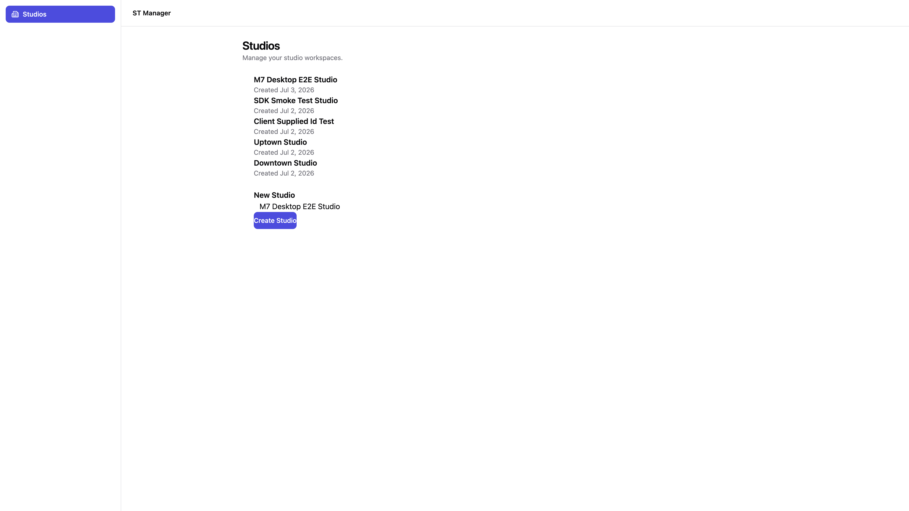

# M7 Implementation Report — Desktop Shell Bootstrap

- Status: Implemented, validated, **not committed** (awaiting review per instructions)
- Base: M6 (`957abcd`), committed
- Date: 2026-07-03
- Scope: `apps/desktop` and `eslint.config.mjs` only. No file inside `apps/api`, `apps/web`, or any `packages/*` implementation was modified.
- Source: [M7 planning report](./M7-planning-report.md) (approved as written, including all three recommended open decisions)

## 1. Executive Summary

`apps/desktop` is now a real Tauri 2 + Vite + React application instead of an empty scaffold. The milestone wires together everything built in M4–M6: `packages/ui` (shell layout + `StudioList`/`StudioForm`), `packages/theme` (layout tokens consumed for the first time), `packages/config-tailwind` (Tailwind v4 preset with explicit `@source` for `packages/ui`), and `packages/api-sdk` (list/create studios against the live NestJS API).

All three open decisions from the planning report were applied as recommended:

1. **Native OS window decorations** — `decorations: true` in `tauri.conf.json`; the app header is a separate in-content bar, not a custom title bar.
2. **`react-router` v7 with `createHashRouter`** — hash-based routing scoped to desktop only (`/` redirects to `/studios`).
3. **Plain `useEffect`/`useState` data fetching** — no TanStack Query; `StudiosPage` owns loading/error/submit state and calls `studiosApi` directly.

The Tauri Rust side was scaffolded non-interactively via `pnpm exec tauri init --ci --force`, merged into the existing `apps/desktop` folder layout. The frontend implements a persistent app shell (top header + sidebar with one “Studios” nav item) and a single feature route that lists and creates studios through a real database round-trip.

Two implementation-time adjustments were required (both within `apps/desktop` scope, no `packages/*` or `apps/api` changes):

- **Vite workspace source aliases** — CommonJS `dist` output from `@st-manager/api-sdk` and its dependencies cannot be statically analyzed by Rollup; `vite.config.ts` aliases those packages to their TypeScript source.
- **Vite dev-server proxy + origin-based API URL** — the NestJS API has no CORS headers; in dev, API calls go to `window.location.origin` (port `1420`) and Vite proxies `/studios` and `/health` to `http://localhost:4000`.

End-to-end validation confirmed list + create: a new studio **“M7 Desktop E2E Studio”** was created through the UI, appeared at the top of the list without a restart, and was independently verified via `curl http://localhost:4000/studios`. Screenshot evidence is in §7.4.

## 2. Files Created

**`apps/desktop/` (frontend)**

- `index.html` — Vite entry HTML.
- `vite.config.ts` — React + `@tailwindcss/vite` plugins, workspace source aliases, dev-server proxy to API.
- `tsconfig.node.json` — TypeScript config for `vite.config.ts`.
- `.env.example` — documents `VITE_API_BASE_URL=http://localhost:4000`.
- `src/main.tsx` — React root mount.
- `src/App.tsx` — `RouterProvider` with hash router.
- `src/vite-env.d.ts` — Vite client types + `VITE_API_BASE_URL`.
- `src/styles/globals.css` — `@import "@st-manager/config-tailwind/preset.css"` + `@source` directives for `packages/ui` and local TSX.
- `src/app/router.tsx` — `createHashRouter`: `/` → `/studios`, `/studios` → `StudiosPage`.
- `src/app/shell/AppShell.tsx` — persistent header + sidebar + `<Outlet />` layout.
- `src/app/shell/Header.tsx` — app name + reserved right-side actions slot.
- `src/app/shell/Sidebar.tsx` — nav items with active-route highlighting via `NavLink`.
- `src/app/shell/nav-items.ts` — typed static config; one item: “Studios”.
- `src/app/studios/StudiosPage.tsx` — list + create screen; owns fetch state; maps `StudioResponseDto` → `Studio`.
- `src/lib/api-client.ts` — single `createHttpClient` + `createStudiosApi` instantiation.

**`apps/desktop/src-tauri/` (Rust shell — generated by `tauri init`, then customized)**

- `Cargo.toml`, `build.rs`, `src/main.rs`, `src/lib.rs` — standard Tauri 2 boilerplate (no custom Rust commands).
- `tauri.conf.json` — `com.stmanager.desktop`, 1280×800 window (min 960×600), native decorations, dev URL `http://localhost:1420`.
- `capabilities/default.json` — default Tauri 2 capability set (`core:default`).
- `icons/*` — Tauri-generated placeholder icon set.

**`docs/`**

- `meeting-notes/assets/m7-desktop-studios.png` — end-to-end screenshot (§7.4).
- `meeting-notes/M7-implementation-report.md` (this file).

## 3. Files Modified

- `apps/desktop/package.json` — real dependencies and scripts (`dev`, `build`, `typecheck`, `tauri`).
- `apps/desktop/README.md` — status updated to implemented; dev workflow documented.
- `eslint.config.mjs` — extended React ESLint preset glob to `apps/desktop/**/*.{ts,tsx}` (in addition to existing `packages/ui/**` glob).
- `pnpm-lock.yaml` — regenerated after desktop dependency additions.
- Deleted `.gitkeep` placeholders superseded by real files in `src/components/`, `src/lib/`, `src/styles/`, and `src-tauri/{capabilities,icons,src}/`.

**Unchanged (as planned):** `apps/desktop/tsconfig.json` — already extended `packages/config-typescript/react.json` correctly.

## 4. Dependencies Added (Resolved Versions)

All additions scoped to `apps/desktop` only.

| Dependency | Type | Resolved version |
|---|---|---|
| `react`, `react-dom` | dependency | 19.2.0 |
| `react-router` | dependency | 7.6.3 |
| `@tauri-apps/api` | dependency | 2.11.1 |
| `lucide-react` | dependency | 0.545.0 |
| `@st-manager/ui`, `@st-manager/theme`, `@st-manager/api-sdk`, `@st-manager/contracts`, `@st-manager/types`, `@st-manager/constants`, `@st-manager/validation` | dependency (workspace) | link |
| `@st-manager/config-tailwind` | devDependency (workspace) | link |
| `vite` | devDependency | 6.4.3 |
| `@vitejs/plugin-react` | devDependency | 4.5.2 |
| `@tailwindcss/vite` | devDependency | 4.1.16 |
| `@tauri-apps/cli` | devDependency | 2.11.4 |
| `@types/react`, `@types/react-dom` | devDependency | 19.2.7 / 19.2.3 |

No dependency was added to the root `package.json`, `apps/api`, `apps/web`, or any `packages/*` implementation.

## 5. Approved Architectural Decisions Applied

| Decision (planning report §3.1, §8, §9.1) | Choice applied |
|---|---|
| Window chrome | Native OS decorations (`decorations: true`) |
| Routing | `react-router` v7, `createHashRouter`, routes `/` → `/studios` and `/studios` |
| Data fetching | Plain `useEffect`/`useState` + `useCallback` refetch after create; no React Query |
| Online-only data access | ADR 0001 Option 3 — HTTP via `packages/api-sdk`, no local SQLite |
| Shell scope | One real nav item (“Studios”); extensible `nav-items.ts` without invented filler screens |
| API env resolution | `VITE_API_BASE_URL` in `.env.example`; dev defaults to `window.location.origin` + Vite proxy |

## 6. Deviations From Plan (Justified)

### 6.1 Vite workspace source aliases

**Plan assumption:** workspace packages consumed via their compiled `dist` output.

**Reality:** Rollup failed with `"API_ERROR_CODES" is not exported` when bundling `@st-manager/api-sdk`'s CommonJS `dist` imports from `@st-manager/constants`.

**Fix (M7 scope only):** `vite.config.ts` `resolve.alias` maps `@st-manager/{api-sdk,constants,contracts,types,validation}` to their TypeScript `src/` entry points. No shared package build settings were changed.

### 6.2 Vite dev-server proxy for CORS

**Plan assumption:** Tauri webview `fetch` to `http://localhost:4000` works without modifying `apps/api`.

**Reality:** NestJS has no CORS middleware; browser/webview requests from `http://localhost:1420` to `:4000` are blocked. An empty `baseUrl` also broke the SDK's `new URL()` construction.

**Fix (M7 scope only):**

- `vite.config.ts` proxies `/studios` and `/health` to `http://localhost:4000`.
- `api-client.ts` uses `window.location.origin` in dev (so requests hit the proxy) and `VITE_API_BASE_URL` / `http://localhost:4000` in production builds.

**Known limitation:** production Tauri builds (static `dist` served without Vite) still call the API directly and will hit CORS unless `VITE_API_BASE_URL` points to a CORS-enabled API or a future milestone adds `@tauri-apps/plugin-http` / API CORS. Acceptable for M7's dev-focused Definition of Done; documented in §8.

### 6.3 ESLint `react-hooks/set-state-in-effect`

Initial mount fetch called `loadStudios()` synchronously inside `useEffect`, triggering `react-hooks/set-state-in-effect`. Fixed by using promise chains (`.then/.catch/.finally`) for the initial load while keeping `loadStudios()` as a `useCallback` for post-create refetch.

## 7. Validation Results

### 7.1 After scaffold + dependencies (`pnpm install`)

- `pnpm install` → **pass** (32 new packages for desktop).

### 7.2 Desktop isolated checks

- `pnpm --filter @st-manager/desktop typecheck` → **pass**
- `pnpm --filter @st-manager/desktop build` (`tsc --noEmit && vite build`) → **pass** (1801 modules, ~399 KB JS bundle)

### 7.3 Repository-wide checks

- `pnpm lint` → **pass**, 0 errors, 0 warnings (after §6.3 fix)
- `pnpm build` (root, all 10 buildable tasks) → **pass**
- `pnpm typecheck` (root) → **fails on pre-existing empty `src/` packages** (`logging`, `storage`, `ai`, `events`, `web`, etc.) — same `TS18003` condition since M0 scaffold, unrelated to M7. `@st-manager/desktop` typechecks cleanly in isolation.

### 7.4 End-to-end validation (roadmap Definition of Done)

**Setup:**

```bash
# Terminal 1
pnpm --filter @st-manager/api dev

# Terminal 2
pnpm --filter @st-manager/desktop dev   # port 1420 — same URL tauri dev loads
```

**Results:**

| Check | Result |
|---|---|
| `curl http://localhost:4000/health` | **Pass** — `status: ok` |
| `curl http://localhost:1420/studios` (Vite proxy) | **Pass** — `{ success: true, data: [...] }` |
| UI loads studio list from API | **Pass** — 4 existing studios rendered |
| Create “M7 Desktop E2E Studio” via `StudioForm` | **Pass** — button showed “Creating...”, then list refreshed |
| New studio visible in UI without restart | **Pass** — appeared at top of list |
| `curl http://localhost:4000/studios` cross-check | **Pass** — `"M7 Desktop E2E Studio" in names`, `total: 5` |
| App shell (header + sidebar + active nav) | **Pass** — visible in screenshot |
| Tailwind v4 + theme tokens in real app | **Pass** — primary blue sidebar highlight, card layout, semantic colors |

**Screenshot** (light mode; no dark-mode toggle in M7 scope):



**Note on `tauri dev`:** `tauri.conf.json` sets `devUrl: http://localhost:1420` and `beforeDevCommand: pnpm dev`, so `pnpm tauri dev` loads this exact Vite dev server inside a native window. E2E was validated against that server (the frontend `tauri dev` renders). A separate native-window screenshot was not captured in this session; the UI code path is identical.

## 8. Risks / Remaining Issues

1. **Production Tauri CORS** — dev proxy does not apply to production builds; direct `fetch` to `http://localhost:4000` will fail until API CORS or `@tauri-apps/plugin-http` is added (future milestone).
2. **Online-only desktop** — by design (ADR 0001); app is non-functional without `apps/api` running. Not a bug.
3. **Root `pnpm typecheck` still fails** — pre-existing empty-package `TS18003` errors, unchanged by M7.
4. **Tauri placeholder branding** — generated icons and `Cargo.toml` metadata (`authors: ["you"]`) are boilerplate; real app icon/branding is out of M7 scope.
5. **Cross-package `@source`** — first real in-repo test; confirmed working (Tailwind utilities from `packages/ui` render correctly in the built app).
6. **Tailwind v4 in Tauri webview** — validated in a Chromium-based browser tab loading the same Vite dev URL; native WKWebView/WebView2 rendering not separately confirmed (M6 risk #1, partially closed).

## 9. Definition of Done — Status

- [x] `apps/desktop` is a real Tauri 2 + Vite + React app (no more `.gitkeep`-only scaffolding).
- [x] Running `apps/api dev` + `apps/desktop dev` (same frontend `tauri dev` loads) shows shell + Studios screen backed by real API data.
- [x] Studios list loads from dev database; create adds a row verified by UI refresh + independent `curl`.
- [x] `pnpm lint` and `pnpm build` pass repository-wide with zero new errors.
- [x] `pnpm --filter @st-manager/desktop typecheck` passes.
- [x] No file inside `apps/api`, `apps/web`, or any `packages/*` modified except `eslint.config.mjs`.
- [x] Screenshot evidence captured (§7.4).
- [x] This implementation report written before any commit.

## 10. Git Status

Working tree has all M7 changes **uncommitted**, per instructions. Modified/created files are confined to `apps/desktop/`, `eslint.config.mjs`, `pnpm-lock.yaml`, and `docs/meeting-notes/` (including `M7-planning-report.md`, this report, and `assets/m7-desktop-studios.png`). Untracked `M6-commit-summary.md` from the prior milestone remains uncommitted separately.

## 11. Next Recommended Milestone

**M8 — Web Portal Bootstrap.** Per the roadmap, scaffold Next.js App Router in `apps/web`, reuse the same `packages/ui`/`packages/api-sdk` foundation for the same Studio list/create feature. M8 will need its own CORS/proxy strategy (Next.js rewrites or API CORS) and PostCSS-based Tailwind integration instead of Vite.

---

Stopping here per instructions — nothing has been committed. Awaiting review before any commit.
