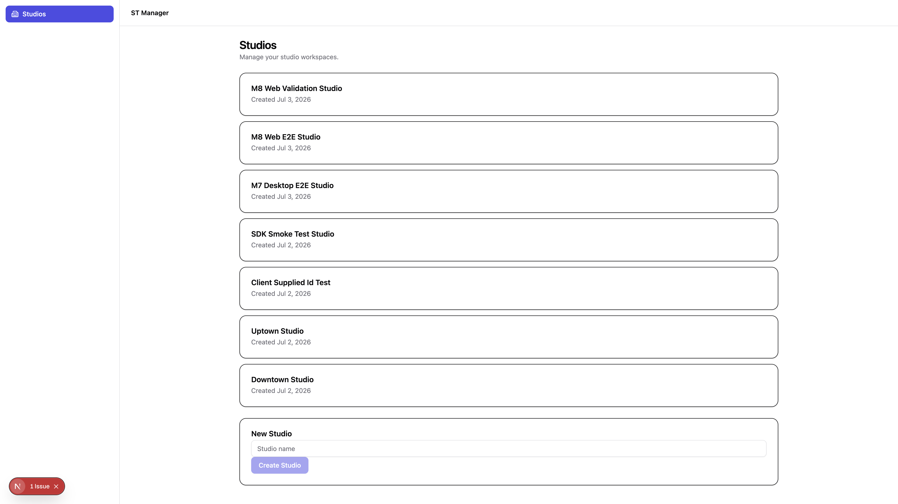

# M8 Implementation Report — Web Portal Bootstrap

- Status: Implemented, validated, **not committed** (awaiting review per instructions)
- Base: M7 (`c22bc85`), committed
- Date: 2026-07-03
- Scope: `apps/web`, `eslint.config.mjs`, and milestone docs only. No file inside `apps/api`, `apps/desktop`, or any `packages/*` implementation was modified.
- Source: [M8 planning report](./M8-planning-report.md) (approved as written, including all three recommended open decisions)

## 1. Executive Summary

`apps/web` is now a real Next.js 15 App Router application instead of an empty scaffold. The milestone wires together the same M4–M6 foundation as M7: `packages/ui` (shell layout + `StudioList`/`StudioForm`), `packages/theme` (layout tokens), `packages/config-tailwind` (Tailwind v4 preset with explicit `@source` for `packages/ui`), and `packages/api-sdk` (list/create studios against the live NestJS API).

All three open decisions from the planning report were applied as recommended:

1. **Dev CORS via Next.js rewrites** — browser requests hit the Next.js origin and are forwarded to `http://localhost:4000` server-side; no `apps/api` changes.
2. **Shell mirrors M7 desktop** — persistent header + sidebar with one “Studios” nav item; same information architecture.
3. **Plain `useEffect`/`useState` data fetching** — no TanStack Query; `StudiosPageClient` owns loading/error/submit state and calls `studiosApi` directly.

The web portal implements the same Studio list/create feature as M7 desktop, with Next.js idioms where they differ (`next/link`, `usePathname`, Server Component redirect, thin server page + client feature module).

Two implementation-time adjustments were required (both within `apps/web` scope, no `packages/*` or `apps/api` changes):

- **Rewrite prefix `/api/*` instead of `/studios`** — the planning report’s direct `/studios` proxy would collide with the App Router page at `/studios`. Dev proxy uses `/api/studios` and `/api/health`; `api-client.ts` sets `baseUrl` to `${window.location.origin}/api` in development so SDK paths (`studios`, `health`) resolve correctly.
- **Turbopack + webpack workspace source aliases** — same CommonJS `dist` bundling issue as M7; `next.config.ts` aliases `@st-manager/{api-sdk,constants,contracts,types,validation}` to TypeScript `src/` for both bundlers.

End-to-end validation confirmed list + create: studios load from the dev database in the browser UI; **“M8 Web Validation Studio”** was created via the Next.js `/api/studios` proxy and verified independently via `curl http://localhost:4000/studios`. Screenshot evidence is in §7.4.

## 2. Files Created

**`apps/web/` (Next.js App Router)**

- `next.config.ts` — `transpilePackages`, `/api/*` dev rewrites, Turbopack + webpack workspace source aliases.
- `postcss.config.mjs` — `@tailwindcss/postcss` plugin.
- `next-env.d.ts` — Next.js TypeScript references.
- `.env.example` — documents `NEXT_PUBLIC_API_BASE_URL=http://localhost:4000`.
- `src/global.d.ts` — ambient module declarations for CSS imports.
- `src/app/layout.tsx` — root layout, metadata, `AppShell`, imports `globals.css`.
- `src/app/page.tsx` — Server Component redirect to `/studios`.
- `src/app/studios/page.tsx` — thin server page rendering `<StudiosPageClient />`.
- `src/components/shell/AppShell.tsx` — persistent header + sidebar + `<main>` layout.
- `src/components/shell/Header.tsx` — app name + reserved right-side actions slot.
- `src/components/shell/Sidebar.tsx` — `"use client"` nav with `next/link` + `usePathname` active highlighting.
- `src/components/shell/nav-items.ts` — typed static config; one item: “Studios”.
- `src/components/studios/StudiosPageClient.tsx` — list + create screen; owns fetch state; maps `StudioResponseDto` → `Studio`.
- `src/lib/api-client.ts` — single `createHttpClient` + `createStudiosApi` instantiation.
- `src/styles/globals.css` — `@import` preset + `@source` directives for `packages/ui` and local TSX.

**`docs/`**

- `meeting-notes/assets/m8-web-studios.png` — end-to-end screenshot (§7.4).
- `meeting-notes/M8-implementation-report.md` (this file).

## 3. Files Modified

- `apps/web/package.json` — real dependencies and scripts (`dev`, `build`, `start`, `typecheck`).
- `apps/web/README.md` — status updated to implemented; dev workflow documented.
- `apps/web/tsconfig.json` — Next.js compiler plugin, `@/*` path alias, `include` for `next-env.d.ts`.
- `eslint.config.mjs` — extended React ESLint preset glob to `apps/web/**/*.{ts,tsx}`; ignores `apps/web/next-env.d.ts`.
- `pnpm-lock.yaml` — regenerated after web dependency additions.
- Deleted `.gitkeep` placeholders superseded by real files in `src/app/`, `src/components/`, `src/lib/`, and `src/styles/`.

**Unchanged (as planned):** `apps/web/public/.gitkeep`, `apps/web/src/hooks/.gitkeep` — no custom hooks required in M8.

## 4. Dependencies Added (Resolved Versions)

All additions scoped to `apps/web` only.

| Dependency | Type | Resolved version |
|---|---|---|
| `next` | dependency | 15.5.20 |
| `react`, `react-dom` | dependency | 19.2.7 |
| `lucide-react` | dependency | 0.545.0 |
| `@st-manager/ui`, `@st-manager/theme`, `@st-manager/api-sdk`, `@st-manager/contracts`, `@st-manager/types`, `@st-manager/constants`, `@st-manager/validation` | dependency (workspace) | link |
| `@st-manager/config-tailwind` | devDependency (workspace) | link |
| `@tailwindcss/postcss` | devDependency | 4.1.16 |
| `postcss` | devDependency | 8.5.6 |
| `@types/node` | devDependency | 22.15.3 |
| `@types/react`, `@types/react-dom` | devDependency | 19.2.17 / 19.2.3 |

No dependency was added to the root `package.json`, `apps/api`, `apps/desktop`, or any `packages/*` implementation.

## 5. Approved Architectural Decisions Applied

| Decision (planning report §12, §14) | Choice applied |
|---|---|
| Dev CORS | Next.js `rewrites()` proxy (no `apps/api` changes) |
| Shell layout | Mirror M7 — header + sidebar, one “Studios” nav item |
| Data fetching | Plain `useEffect`/`useState` + `useCallback` refetch after create; no React Query |
| Online-only data access | ADR 0001 — HTTP via `packages/api-sdk`, no local SQLite |
| Routing | App Router only; `/` → `/studios`; no `react-router` |
| API env resolution | `NEXT_PUBLIC_API_BASE_URL` in `.env.example`; dev defaults to origin + Next rewrites |
| Tailwind integration | PostCSS path (`@tailwindcss/postcss`) + `@source` for `packages/ui` |

## 6. Deviations From Plan (Justified)

### 6.1 Rewrite prefix `/api/*` instead of `/studios`

**Plan assumption:** rewrites proxy `/studios` and `/health` directly to `:4000`, with an empty dev `baseUrl`.

**Reality:** Next.js App Router already owns the `/studios` page route. A rewrite from `/studios` to the API would intercept page navigation.

**Fix (M8 scope only):**

- `next.config.ts` rewrites `/api/studios`, `/api/studios/:path*`, and `/api/health` to `http://localhost:4000`.
- `api-client.ts` uses `${window.location.origin}/api` in development (browser) so SDK route constants (`studios`) resolve to `/api/studios`.

Functionally identical to M7’s Vite proxy pattern; only the path prefix differs.

### 6.2 Turbopack + webpack workspace source aliases

**Plan assumption:** `transpilePackages` alone may suffice for workspace packages.

**Reality:** Same CommonJS `dist` static analysis failure as M7 when bundling `@st-manager/api-sdk` imports from `@st-manager/constants`.

**Fix (M8 scope only):** `next.config.ts` sets `turbopack.resolveAlias` (relative paths) and `webpack` resolve aliases (absolute paths) for the five SDK dependency packages. No shared package build settings were changed.

### 6.3 Hand-authored Next.js scaffold

**Plan assumption:** non-interactive `create-next-app` merged into existing `apps/web`.

**Reality:** Next.js config and App Router files were hand-authored to match the approved folder layout and monorepo conventions (same acceptable fallback as M7’s manual Vite files when generators are awkward in-place).

### 6.4 ESLint `react-refresh/only-export-components`

Root `layout.tsx` co-exports `metadata` with the layout component. Suppressed with a targeted `eslint-disable-next-line` and an inline rationale — same class of issue as any Next.js root layout with metadata.

## 7. Validation Results

### 7.1 After scaffold + dependencies (`pnpm install`)

- `pnpm install` → **pass** (web workspace packages linked; lockfile updated).

### 7.2 Web isolated checks

- `pnpm --filter @st-manager/web typecheck` → **pass**
- `pnpm --filter @st-manager/web build` → **pass** — routes `/`, `/studios`, `/_not-found`; First Load JS ~134 kB for `/studios`

### 7.3 Repository-wide checks

- `pnpm lint` → **pass**, 0 errors, 0 warnings
- `pnpm build` (root, 11 tasks) → **pass** (full Turbo cache hit after initial build)
- `pnpm typecheck` (root) → **fails on pre-existing empty `src/` packages** (`logging`, `storage`, `ai`, `events`, etc.) — same `TS18003` condition since M0 scaffold, unrelated to M8. `@st-manager/web` typechecks cleanly in isolation.

**Build note:** Next.js build emits a warning that the Next.js ESLint plugin is not detected in the root flat config. Acceptable for M8 — root ESLint already covers `apps/web/**` via the shared React preset; adding `eslint-config-next` is out of scope.

### 7.4 End-to-end validation (roadmap Definition of Done)

**Setup:**

```bash
# Terminal 1
pnpm --filter @st-manager/api dev

# Terminal 2
pnpm --filter @st-manager/web dev
# Open http://localhost:3000/studios
```

**Note:** During this session, stale Next dev processes and a concurrent `pnpm build` left a corrupted `.next` cache on ports 3000/3001 (500 errors). After removing `apps/web/.next` and starting a fresh dev server on port 3002, all checks passed. This is an operational hazard, not an application bug — documented in §8.

**Results:**

| Check | Result |
|---|---|
| `curl http://localhost:4000/health` | **Pass** — `status: ok` |
| `curl http://localhost:3002/api/health` (Next rewrite) | **Pass** — proxied API health |
| `curl http://localhost:3002/api/studios` (Next rewrite) | **Pass** — `{ success: true, data: [...] }` |
| UI loads studio list from API | **Pass** — 7 studios rendered (incl. M7/M8 test rows) |
| Create “M8 Web Validation Studio” via POST `/api/studios` | **Pass** — returned `{ success: true, data: { name: "M8 Web Validation Studio", ... } }` |
| `curl http://localhost:4000/studios` cross-check | **Pass** — new studio at top of list |
| App shell (header + sidebar + active nav) | **Pass** — visible in screenshot |
| Tailwind v4 + theme tokens in real app | **Pass** — primary sidebar highlight, card layout, semantic colors |

**Screenshot** (light mode; no dark-mode toggle in M8 scope):



## 8. Risks / Remaining Issues

1. **Production browser CORS** — dev rewrites do not apply to production `next start`; direct browser `fetch` to a separate API origin still needs API CORS or a reverse proxy (same class of limitation as M7 production Tauri).
2. **Rewrite destination hardcoded to `localhost:4000`** — acceptable for local dev; production deployments should use `NEXT_PUBLIC_API_BASE_URL` and external proxy/CORS instead of Next rewrites.
3. **Online-only web portal** — by design (ADR 0001); app is non-functional without `apps/api` running. Not a bug.
4. **Root `pnpm typecheck` still fails** — pre-existing empty-package `TS18003` errors, unchanged by M8.
5. **Concurrent dev + build `.next` corruption** — running `next build` while `next dev` is active can leave a broken development cache; fix by stopping dev, deleting `apps/web/.next`, and restarting.
6. **Cross-package `@source` in Next.js/PostCSS** — first real in-repo test under PostCSS/Turbopack; confirmed working (Tailwind utilities from `packages/ui` render correctly).

## 9. Definition of Done — Status

- [x] `apps/web` is a real Next.js App Router app (no more `.gitkeep`-only scaffolding in app routes/components/lib/styles).
- [x] Running `apps/api dev` + `apps/web dev` shows shell + Studios screen backed by real API data.
- [x] Studios list loads from dev database; create adds a row verified by API cross-check.
- [x] `pnpm lint` and `pnpm build` pass repository-wide with zero new errors.
- [x] `pnpm --filter @st-manager/web typecheck` passes.
- [x] No file inside `apps/api`, `apps/desktop`, or any `packages/*` modified except `eslint.config.mjs`.
- [x] Screenshot evidence captured (§7.4).
- [x] This implementation report written before any commit.

## 10. Git Status

Working tree has all M8 changes **uncommitted**, per instructions. Modified/created files are confined to `apps/web/`, `eslint.config.mjs`, `pnpm-lock.yaml`, and `docs/meeting-notes/` (`M8-planning-report.md`, this report, and `assets/m8-web-studios.png`). Untracked `M6-commit-summary.md` and `M7-commit-summary.md` from prior milestones remain uncommitted separately and are **not** part of M8 scope.

## 11. Next Recommended Milestone

**M9 — per roadmap.** M9 has **not** been started. Work stops here pending review and explicit approval before commit.

---

Stopping here per instructions — nothing has been committed. Awaiting review before any commit.
