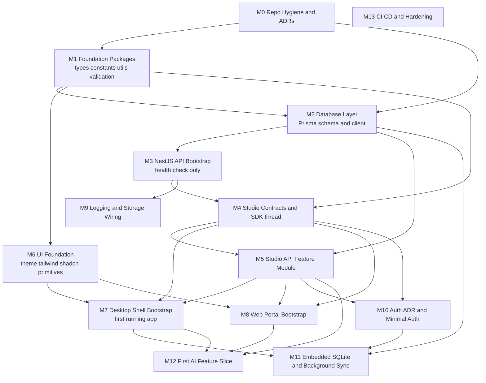
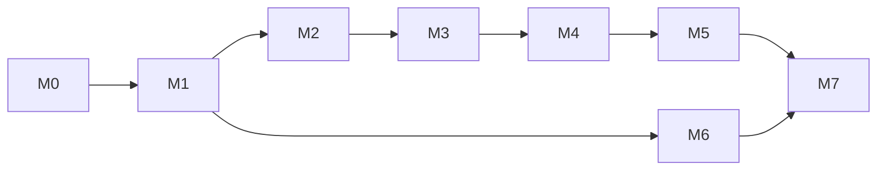

# Phase 2 Implementation Roadmap

Status: proposed, awaiting approval. No application code has been generated yet.

## Goal

Move from the frozen v3 architecture scaffold (folders, config stubs, no source) to a running, end-to-end system — starting from the **smallest vertical slice that can become a real desktop application**, then expanding outward to the web portal, offline sync, auth, and AI features.

## Guiding principle: walking skeleton first

Rather than building each package to completeness in isolation, Phase 2 builds one thin feature (a `Studio` entity: list + create) all the way through every layer first — database, API, contracts, UI, desktop shell — before widening scope. This proves the whole stack wires together early and gives a real `pnpm tauri dev` window as fast as possible.

The first runnable desktop app (end of M7) talks to the NestJS API over HTTP like a normal online client. Embedded SQLite + background sync (the harder offline problem) is deliberately deferred to M11, built on top of a stack that already works, rather than solved on day one.

## Milestone dependency graph

## Milestones

### M0 — Repository Hygiene and Architecture Decision Records

**Goal:** close open decisions before code depends on them.

- Write ADR: desktop local data access strategy. Options: (a) Tauri Rust side owns SQLite directly via `rusqlite`/`sqlx`, exposed as Tauri commands; (b) bundle a Node sidecar running the existing Prisma client; (c) desktop always calls the API online, no local DB, until M11. **Recommendation: (c) for M7, revisit (a) vs (b) at M11** — this is what unlocks the "smallest slice" framing above.
- Write ADR: authentication provider (currently TBD per frozen architecture). Needed before M10, not before.
- Populate `packages/config-eslint` with a real shared ESLint config (flat config, TypeScript + React + Nest presets) and wire it into root `lint` script.
- No dependencies. Can start immediately.

**Definition of done:** two ADRs committed under `docs/system-architecture/adr/`, ESLint config functional (`pnpm lint` runs without "command not found").

### M1 — Foundation Packages (types, constants, utils, validation)

**Goal:** the leaf packages every other layer imports from.

- `packages/types`: define the `Studio` entity type (id, name, createdAt, updatedAt) as the first real domain type.
- `packages/constants`: define `ROUTES`, a minimal `ROLES` placeholder (unused until M10), pagination limits.
- `packages/utils`: one real helper (e.g. date formatting) to prove the build pipeline.
- `packages/validation`: a `createStudioSchema` (Zod) matching the `Studio` type.
- Add a real build step to each (`tsup` or `tsc -p tsconfig.json --emitDeclarationOnly` + a `build` script), and `exports`/`main`/`types` fields in `package.json` so other workspace packages can import them via `workspace:*`.

**Depends on:** M0 (lint config ideally in place first, not blocking).

**Definition of done:** `pnpm build` succeeds for all four packages; `pnpm typecheck` passes for them (resolves the current `TS18003` empty-input failure for these four).

### M2 — Database Layer Bootstrap

**Goal:** first real Prisma schema and generated client.

- `prisma init` inside `packages/database`.
- Define a minimal `schema.prisma` with the `Studio` model only.
- Resolve the dual-provider question: maintain two schema variants (`schema.postgresql.prisma` for `apps/api`, `schema.sqlite.prisma` for later desktop use per the M0 ADR) or a single schema with datasource URL swapped via `DATABASE_URL` env var (works if both providers stay schema-compatible for the models in play — simplest for now, revisit if provider-specific features are needed later).
- Generate the Prisma Client, export a typed singleton from `packages/database/src/index.ts`.
- First migration created and committed.

**Depends on:** M0 (ADR informs schema strategy), M1 (types package should mirror/derive from Prisma types where sensible).

**Definition of done:** `prisma migrate dev` runs locally against SQLite; `packages/database` exports a working client; a throwaway script can create and read a `Studio` row.

### M3 — NestJS API Bootstrap

**Goal:** the smallest possible running API.

- Bootstrap `apps/api` with `main.ts`, `app.module.ts`, `src/config` (env validation via `@nestjs/config` + `packages/validation`), a single `GET /health` endpoint.
- Wire `packages/database`'s Prisma client into a `PrismaModule`/`PrismaService` in `src/common`.

**Depends on:** M2.

**Definition of done:** `pnpm --filter @st-manager/api dev` starts the server; `curl localhost:PORT/health` returns 200.

### M4 — Studio Contracts and SDK Thread

**Goal:** the typed contract between API and every client, for one resource.

- `packages/contracts`: `CreateStudioDto`, `StudioResponseDto`.
- `packages/validation`: request-side schema reused from M1 wiring into `class-validator`-compatible or Zod pipe in Nest.
- `packages/api-sdk`: `studios.api.ts` with `listStudios()`, `createStudio()`, base HTTP client in `src/client` (fetch wrapper, base URL from env, no auth header logic yet — added in M10).

**Depends on:** M1, M3 (contract shapes should match what M3's controller will expose, even though the controller itself lands in M5 — contracts are designed together with the API module).

**Definition of done:** `packages/api-sdk` builds and typechecks against `packages/contracts` with zero implementation of the actual endpoint yet (endpoint lands in M5).

### M5 — Studio API Feature Module

**Goal:** real CRUD (Create + List for MVP) behind the API.

- `apps/api/src/modules/studios`: controller (`POST /studios`, `GET /studios`), service using `PrismaService`, DTO validation via `packages/validation`/`packages/contracts`.
- Update `packages/api-sdk` calls to point at the real endpoint; remove any temporary stubs from M4.

**Depends on:** M2, M4.

**Definition of done:** end-to-end `curl` (or REST client) can create and list studios against a real SQLite/Postgres dev database.

### M6 — UI Foundation

**Goal:** a small, real shared component set — not a full design system yet.

- `packages/theme`: base tokens (color, spacing, radius) as CSS variables + a light theme map.
- `packages/config-tailwind`: preset consuming `packages/theme` tokens.
- `packages/ui`: install shadcn/ui generator config, add `Button`, `Input`, `Card`; one composed `StudioList` + `StudioForm` component consuming `packages/types`.

**Depends on:** M1 (types).

**Definition of done:** a Storybook-less smoke test (a throwaway `.tsx` render in a scratch Vite app, or deferred to M7/M8's actual usage) confirms components compile and render.

### M7 — Desktop Shell Bootstrap (first running desktop app)

**Goal:** `pnpm tauri dev` opens a window showing the Studio list, backed by the real API.

- Scaffold the actual Tauri 2 + Vite + React app inside the existing `apps/desktop` folders (`create-tauri-app`-equivalent output, respecting the folder layout already scaffolded: `src/`, `src-tauri/`).
- Wire `packages/ui`, `packages/theme`, `packages/api-sdk`.
- Single screen: list studios (via `api-sdk.listStudios()`), form to add one (via `api-sdk.createStudio()`).
- Desktop talks to the API over plain HTTP (`http://localhost:PORT`) — no local SQLite yet (per M0 ADR recommendation), no auth yet.

**Depends on:** M4, M5, M6.

**Definition of done:** running `apps/api` in one terminal and `pnpm --filter @st-manager/desktop tauri dev` in another produces a native window that lists and creates studios, backed by a real database round-trip. **This is the target "smallest working vertical slice that can eventually become a running desktop application."**

### M8 — Web Portal Bootstrap

**Goal:** the same Studio feature, in the browser, reusing the same foundation.

- Next.js App Router bootstrap in `apps/web`, same list/create feature via `packages/api-sdk` and `packages/ui`.
- Can run in parallel with M7 once M4–M6 land, since both only depend on the same foundation, not on each other.

**Depends on:** M4, M5, M6.

**Definition of done:** `pnpm --filter @st-manager/web dev` serves a page with the same Studio list/create functionality.

### M9 — Logging and Storage Wiring

**Goal:** cross-cutting concerns wired once, reused everywhere.

- Implement a console transport for `packages/logging` and wire it into `apps/api`'s Nest logger.
- Implement a local-filesystem adapter for `packages/storage` (not yet used by a feature — just proven functional).

**Depends on:** M3.

**Definition of done:** API logs structured JSON via the shared logger interface; a throwaway script exercises the storage adapter's put/get/delete.

### M10 — Auth Decision and Minimal Implementation

**Goal:** resolve the TBD auth provider and protect the Studio endpoints.

- ADR decision from M0 finalized (e.g. custom JWT vs Clerk/Auth0).
- Implement session/JWT issuance in `apps/api/src/modules/auth`, token injection + refresh hook in `packages/api-sdk`.
- Protect `POST /studios` behind auth; leave `GET /studios` open or protected per product decision.

**Depends on:** M4, M5.

**Definition of done:** desktop and web clients can log in and the Studio create flow requires a valid session.

### M11 — Embedded SQLite and Background Sync

**Goal:** deliver on the "offline-capable desktop" promise from the frozen architecture.

- Resolve the concrete implementation of the M0 ADR (Rust-native SQLite vs Prisma sidecar) now that a working online app exists to build offline support on top of.
- Local SQLite schema mirroring the `Studio` model (and future models) via `packages/database`'s SQLite provider variant.
- `packages/events` domain events for change tracking (`StudioCreatedLocally`, etc.).
- Sync engine in `apps/desktop` (background task) and corresponding sync endpoints in `apps/api`.

**Depends on:** M7 (working online desktop app), M2, M10 (sync likely needs authenticated requests).

**Definition of done:** creating a Studio while offline in the desktop app persists locally and syncs to PostgreSQL once connectivity returns, without data loss or duplication.

### M12 — First AI Feature Slice

**Goal:** prove the AI package end-to-end with one real, small feature (e.g. AI-generated studio summary/notes).

- `packages/ai`: one prompt template, one provider adapter, one pipeline.
- API endpoint in `apps/api` orchestrating the pipeline.
- UI trigger in desktop and/or web.

**Depends on:** M5, M7, M8.

**Definition of done:** clicking a button in the running app produces an AI-generated result backed by a real provider call.

### M13 — CI/CD and Hardening

**Goal:** make the above sustainable, not a one-off.

- GitHub Actions: lint, typecheck, test, build on PR (`.github/workflows/ci.yml`).
- Unit tests for the Studio feature across `apps/api` and `packages/*`.
- Tauri release workflow (build signing deferred until a release is actually needed).

**Depends on:** ongoing from M3 onward; formalized as its own milestone with exit criteria before Phase 2 is declared complete.

## Suggested execution order (critical path to first running desktop app)

M8 (web), M9 (logging/storage), M10 (auth), M11 (sync), M12 (AI), and M13 (CI/CD) all build outward from that critical path once it is proven working end-to-end.

## What is explicitly out of scope until approved

- No source files, migrations, or generated Prisma clients yet.
- No `create-tauri-app`/`create-next-app` scaffolding run yet.
- No shadcn component installation yet.
- No auth provider chosen yet (ADR pending in M0).
