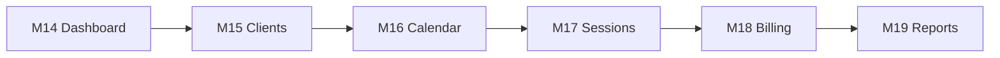

# Phase 3 Implementation Roadmap

Status: **active** — opened by M14 (2026-07-03).

Source: [M14 planning report](../meeting-notes/M14-planning-report.md) (approved).

## Goal

Evolve ST Manager from a Studio list/create demo into a **production-ready recording studio management application** — dashboard-first, client-centric, with booking, sessions, billing, and reporting.

## Guiding principles

1. **Walking skeleton per milestone** — each slice ships end-to-end (schema → API → contracts → UI → validation) before widening scope.
2. **Web-first for operational workflows** — booking calendar, billing, and reports are primarily web experiences.
3. **Reuse existing layers** — `packages/{contracts,validation,api-sdk,ui,theme}`, Nest module pattern, JWT, CI smoke pattern.
4. **Production posture** — PostgreSQL as production datasource; CI validates both SQLite (dev/test) and PostgreSQL (production path).

## Milestone sequence

| Milestone | Domain | Outcome |
|---|---|---|
| **M14** | Dashboard + foundation | Dashboard home, `GET /dashboard/summary`, expanded nav, Phase 3 ADR, PostgreSQL CI |
| **M15** | Client Management | Client CRUD; dashboard client count widget |
| **M16** | Booking Calendar | Calendar UI + conflict detection; today's bookings widget |
| **M17** | Session Management | Session lifecycle; in-progress/completed widgets |
| **M18** | Billing & Invoices | Invoice CRUD + PDF; revenue/outstanding widgets |
| **M19** | Reports & Analytics | Revenue/utilization/client reports + CSV export |

## Explicitly out of Phase 3 scope

- Multi-tenant SaaS isolation
- Payment processor integration (Stripe/PayPal live charges)
- Email/SMS notifications and external calendar sync
- Mobile native apps
- Advanced RBAC
- GDPR export/delete automation beyond ADR 0003 soft-delete pattern

## Architecture references

- [ADR 0004: Phase 3 Domain Overview](../system-architecture/adr/0004-phase3-domain-overview.md)
- [Phase 2 roadmap](./phase2-roadmap.md) — completed at M13

## Validation gates (every milestone)

1. `pnpm lint`, `pnpm typecheck`, `pnpm test`, `pnpm build`
2. Domain smoke script wired into `apps/api/scripts/ci-smoke.sh`
3. Manual e2e: sign in → exercise new screens → verify dashboard widgets
4. `docs/meeting-notes/M{n}-implementation-report.md` before commit approval

## Phase 3 completion criteria (after M19)

- All six business domains shipped with user-visible features
- Dashboard shows **real aggregated data** across domains (not placeholders)
- CI green; smoke suite covers auth, studios, and all new domains
- PostgreSQL migration path verified in CI
- Implementation reports M14–M19 committed
